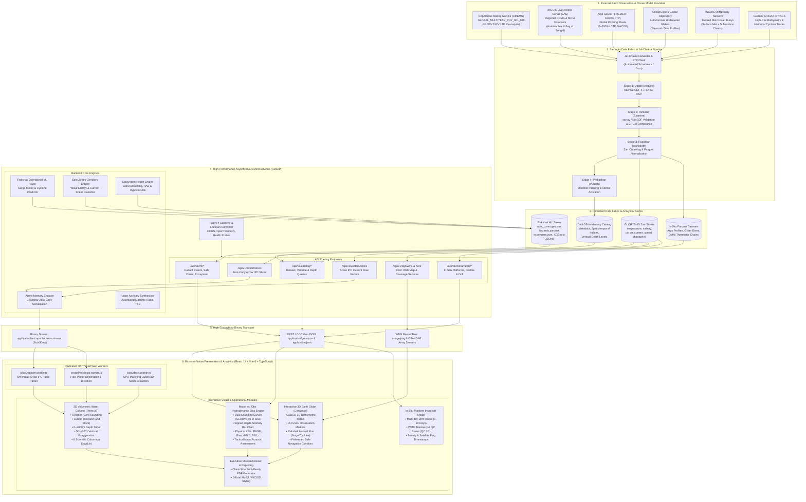
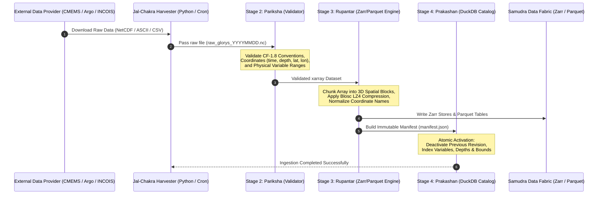
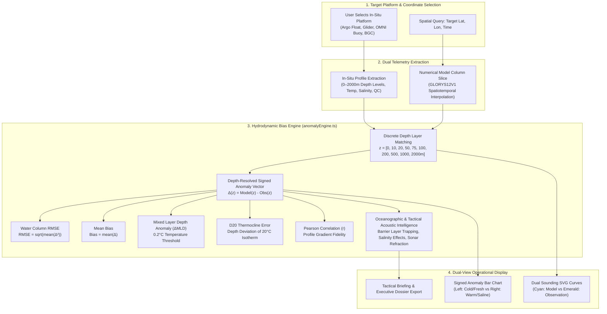
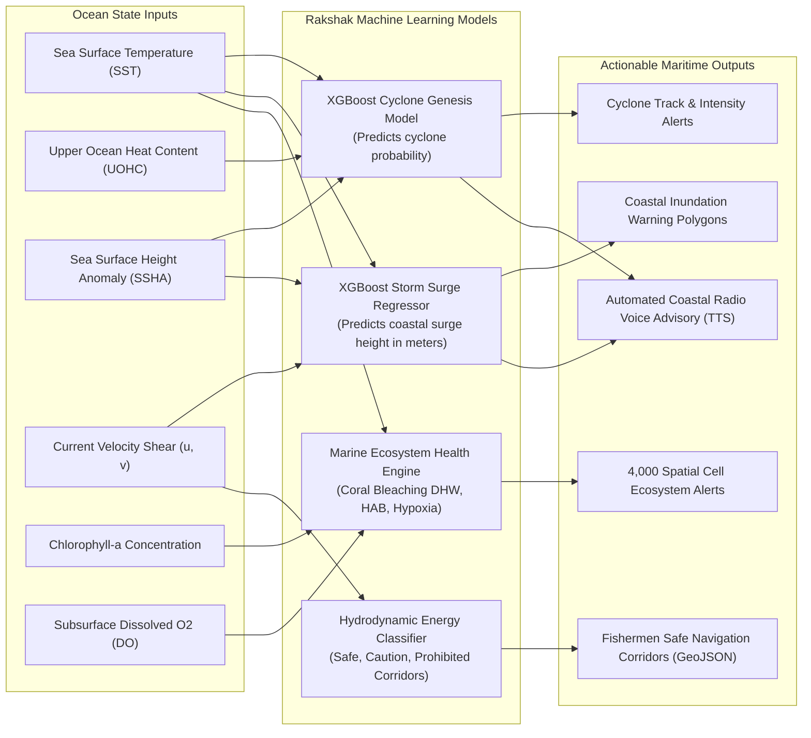
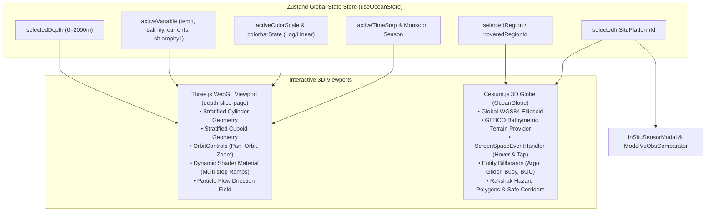

# LEHER — Comprehensive System Architecture & Data Flow Specification
### Official Architecture Reference for Smart India Hackathon (SIH) Problem Statement 26067
**Ministry**: Ministry of Earth Sciences (MoES)  
**Department**: Indian National Centre for Ocean Information Services (INCOIS), Ocean Valley  
**Platform**: **LEHER** (Indian Ocean Maritime Safety & Hazard Intelligence System)  
**Repository**: [DNA-Coded/LEHER](https://github.com/DNA-Coded/LEHER)  

---

## 1. End-to-End System Architecture Diagram



---

## 2. Ingestion & Transformation Pipeline (Jal-Chakra)

The **Jal-Chakra** engine manages automated data transformation across four deterministic stages, converting raw oceanographic datasets into high-speed analytical formats:



### Jal-Chakra Pipeline Stages
1. **Utpatti (Origin)**: Automated download via Copernicus Marine API (`copernicusmarine`) or Argo/Glider GDAC FTP servers into `fabric/raw/`.
2. **Pariksha (Examination)**: Verification using `xarray` and `validator.py`. Validates Climate and Forecast (CF-1.8) conventions, positive-down depth standards, spatial bounding coordinates, and absence of corrupted tiles.
3. **Rupantar (Transformation)**: Re-chunks dense multi-dimensional floating-point tensors into optimized Zarr arrays (`temperature.zarr`, `salinity.zarr`, `uo.zarr`, `vo.zarr`, `chlorophyll.zarr`) and columnar Apache Parquet stores.
4. **Prakashan (Publication)**: Publishes dataset manifests with cryptographic checksums (`SHA-256`), register metadata into DuckDB, and switches the dataset state to active atomically.

---

## 3. High-Speed Binary Streaming Architecture (Arrow IPC)

To eliminate the CPU bottlenecks and network overhead of traditional large JSON payloads, LEHER uses **Zero-Copy Apache Arrow Columnar IPC streaming**:

```mermaid
flowchart LR
    subgraph Backend_Server ["Backend Server (FastAPI)"]
        ZARR[("GLORYS Zarr Arrays")] --> SAMUDRA["Samudra Reader<br/>(Bounding Box & Depth Slicer)"]
        SAMUDRA --> MEM["In-Memory Contiguous<br/>NumPy / Polars Buffer"]
        MEM --> ENCODER["PyArrow IPC Stream Encoder<br/>(RecordBatchStreamWriter)"]
    end

    ENCODER -- "application/vnd.apache.arrow.stream<br/>(Binary IPC Bytes)" --> NETWORK((HTTP/2 Stream))

    subgraph Browser_Client ["Browser Client (React 19)"]
        NETWORK --> WORKER["sliceDecoder.worker.ts<br/>(Dedicated Web Worker)"]
        WORKER --> ARROW_JS["tableFromIPC()<br/>(Zero-Copy Column Unpack)"]
        ARROW_JS --> FLOAT_BUF["Shared Float32Array<br/>(Flat Scalar Grid)"]
        FLOAT_BUF --> GPU["WebGL Shader / Three.js Mesh<br/>(Volumetric Render @ 60 FPS)"]
    end
```



### Performance Advantages:
- **Zero JSON Overhead**: Eliminates text serialization of tens of thousands of coordinate points.
- **Off-Main-Thread Execution**: Web Workers decode Arrow tables asynchronously, ensuring UI animations never drop below 60 FPS.
- **Sub-50ms Latency**: Depth slices transfer in under 50ms across high-density spatial meshes.

---

## 4. Model vs. Observation Hydrodynamic Bias Architecture

The Hydrodynamic Bias Engine simultaneously co-locates 4D numerical model outputs with physical in-situ measurements, addressing the primary operational mandate of INCOIS forecasters:



---

## 5. Rakshak Operational Machine Learning & Disaster Intelligence

The **Rakshak ML Engine** runs continuous monitoring jobs over ocean state variables to provide operational early warnings for INCOIS mandates:



---

## 6. Frontend State & WebGL Rendering Architecture

The frontend architecture separates high-frequency rendering loops from user interactions and state synchronization:



---

## 7. Technology Stack Reference Table

| Tier | Component | Technology / Library | Role in LEHER |
|---|---|---|---|
| **Frontend Core** | Application Framework | React 19 + TypeScript + Vite 6 | High-performance, browser-native UI without client dependencies |
| **Frontend 3D** | Volumetric Sounder | Three.js (WebGL) + @react-three/fiber | Depth-slice visualization, 3D cylinder and cuboid water column models |
| **Frontend Globe** | 3D Geospatial Engine | Cesium.js (Ion & Offline Providers) | Global bathymetry, hazard polygons, and in-situ platform tracking |
| **Frontend Styling** | UI & Glassmorphism | Vanilla CSS + TailwindCSS + Lucide Icons | Dark oceanographic tactical command console styling |
| **Frontend Workers** | Multi-Threading | Web Workers API (`sliceDecoder`, `vectorProcessor`) | Off-thread binary decoding and CPU Marching Cubes calculation |
| **Frontend Transport** | Columnar Client | Apache Arrow JS (`tableFromIPC`) | Sub-50ms zero-copy deserialization of model depth slices |
| **Backend API** | Asynchronous Gateway | Python 3.11+ / FastAPI / Uvicorn | Async REST API, OpenAPI 3.0 schemas, CORS, and lifespan management |
| **Backend Analytics** | In-Memory Catalog | DuckDB + Polars | High-speed analytical metadata indexing and Parquet scanning |
| **Backend Ocean Data** | Multi-Dimensional Parser | `xarray` + `zarr` + `netCDF4` + `h5netcdf` | Climate & Forecast (CF-1.8) NetCDF slicing and chunked Zarr access |
| **Backend Harvester** | Model Fetcher | `copernicusmarine` API Client | Automated subsetting and acquisition of GLORYS12V1 reanalysis |
| **Backend ML** | Hazard Predictors | XGBoost + Scikit-Learn | Real-time storm surge prediction and cyclone genesis probability |
| **Backend Audio** | Coastal Radio Synthesis | `pyttsx3` / gTTS | Automated voice advisory generator for coastal fishing communities |
| **Data Formats** | Standards Compliance | Zarr, Apache Arrow IPC, GeoJSON, Parquet, CF-1.8 | Open standards enabling interoperability with national & international portals |

---

## 8. Directory & Architectural Mapping

```
LEHER/
├── ARCHITECTURE.md                  # Complete System Architecture & Data Flow Reference (This Document)
├── LEHER_SOLUTION_OFFERINGS_PS26067.md # Official SIH PS 26067 Offerings & Compliance Audit
├── PS26067_GAP_ANALYSIS_AND_ROADMAP.md # Detailed Implementation Gap Analysis & Phased Roadmap
├── README.md                        # Project Overview, Setup Instructions & System Guide
│
├── backend/                         # Backend Services & Data Fabric
│   ├── apps/api/leher/              # FastAPI Application Gateway
│   │   ├── main.py                  # API Entrypoint, Lifespan, Scheduler, Routers
│   │   ├── config.py                # Environment Configuration & CORS
│   │   ├── paths.py                 # File & Fabric Path Resolver
│   │   ├── core/                    # Core Utilities (arrow_encoder.py)
│   │   ├── catalog/                 # DuckDB Catalog Metadata Service
│   │   ├── jobs/                    # APScheduler Background Workers (rakshak_job.py)
│   │   └── routers/                 # API Route Handlers (slices, vectors, catalog, ml)
│   │
│   ├── services/jal-chakra/         # Jal-Chakra Ingestion & Transformation Engine
│   │   ├── core/                    # Pipeline, Normalizer, Validator, Rakshak ML Suite
│   │   └── plugins/                 # Ingestion Plugins (copernicus, argo)
│   │
│   └── fabric/                      # Samudra Persistent Data Fabric
│       ├── datasets/glorys/         # GLORYS12V1 Zarr Stores & manifest.json
│       ├── ml/                      # Hazard Models, safe_zones.geojson, ecosystem.json
│       └── raw/                     # Staging Area for Raw NetCDF & ASCII Inputs
│
└── frontend/                        # Frontend Browser-Native Web Application
    ├── src/
    │   ├── App.tsx                  # Client-Side Routing & Top-Level Layout
    │   ├── main.tsx                 # React DOM Root Entry
    │   ├── components/
    │   │   ├── ocean/               # 3D Ocean Components (OceanGlobe, ModelVsObsComparator,
    │   │   │                        # InSituSensorModal, DepthSliceStandalone)
    │   │   └── ui/                  # Application Screens (operations-page, depth-slice-page,
    │   │                            # details-page, about-page, landing-page)
    │   ├── services/                # API Clients (oceanApi.ts, inSituSensorData.ts)
    │   ├── workers/                 # Web Workers (sliceDecoder, vectorProcessor, isosurface)
    │   ├── store/                   # Zustand Global State (useOceanStore.ts)
    │   └── lib/                     # Algorithms (anomalyEngine, bathymetry, colorScales)
    └── public/                      # Static Assets, Bathymetry Models, Earth Simulation
```
