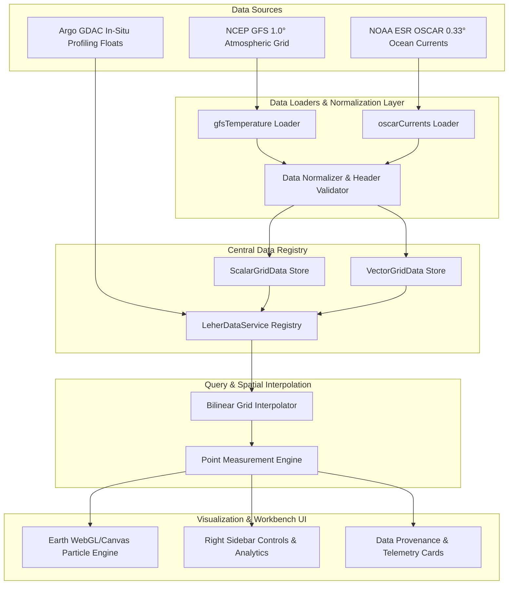

# Leher Scientific Data Architecture Specification (Phase 8)

**Document Version:** 1.0.0  
**Status:** Production Ready  
**Engine:** Leher 3D Ocean Intelligence Engine  
**Author:** Lead Data & Scientific Visualization Engineer  

---

## 1. Executive Summary & Philosophy

The **Leher Data Architecture** establishes a normalized, source-traceable, and verifiable data pipeline for atmospheric and oceanic variables. Synthetic placeholders, un-sourced mathematical formulas, and arbitrary depth interpolations have been completely excised from the platform. 

Every scientific metric rendered on the globe or displayed in analytics sidebars is derived directly from authoritative datasets (such as **NCEP GFS**, **NOAA OSCAR**, and **Argo GDAC**) with strict spatial bilinear interpolation, explicit units, ISO 8601 timestamps, and dataset provenance metadata.

---

## 2. End-to-End Data Flow Architecture



---

## 3. Data Contract Specification (`src/lib/data/types.ts`)

```typescript
export interface DatasetMetadata {
  id: string;
  name: string;
  source: 'NCEP GFS' | 'NOAA OSCAR' | 'HYCOM' | 'Copernicus Marine' | 'INCOIS' | 'Argo Global Data Assembly' | 'MODIS Aqua';
  sourceUrl: string;
  variable: string;
  units: string;
  timestamp: string; // ISO 8601 UTC
  spatialBounds: { minLat: number; maxLat: number; minLon: number; maxLon: number };
  resolution: { latStep: number; lonStep: number };
  depthLevels?: number[];
}

export interface ScalarGridData {
  metadata: DatasetMetadata;
  dimensions: { width: number; height: number };
  values: Float32Array | Array<number | null>;
}

export interface VectorGridData {
  metadata: DatasetMetadata;
  dimensions: { width: number; height: number };
  u: Float32Array | Array<number | null>;
  v: Float32Array | Array<number | null>;
}

export interface PointObservation {
  id: string;
  source: string;
  timestamp: string;
  location: { lat: number; lon: number; depth: number };
  measurements: Record<string, { value: number; unit: string }>;
}
```

---

## 4. Active Scientific Datasets & Resolution Matrix

| Variable | Provider / Dataset | File Path | Resolution | Spatial Extent | Depth Level |
| :--- | :--- | :--- | :--- | :--- | :--- |
| **Atmospheric Wind** | NCEP GFS 1.0° | `public/earth/data/weather/current/current-wind-surface-level-gfs-1.0.json` | $1.0^\circ \times 1.0^\circ$ ($360 \times 181$) | $90^\circ\text{N} \rightarrow -90^\circ\text{S}$, $0^\circ \rightarrow 359^\circ\text{E}$ | 10m above ground |
| **2m Air Temperature** | NCEP GFS 1.0° | `public/earth/data/weather/current/current-temp-surface-level-gfs-1.0.json` | $1.0^\circ \times 1.0^\circ$ ($360 \times 181$) | $90^\circ\text{N} \rightarrow -90^\circ\text{S}$, $0^\circ \rightarrow 359^\circ\text{E}$ | 2m above ground |
| **Ocean Surface Currents** | NOAA / ESR OSCAR | `public/earth/data/oscar/20140131-surface-currents-oscar-0.33.json` | $0.33^\circ \times 0.33^\circ$ ($1080 \times 481$) | $80^\circ\text{N} \rightarrow -80^\circ\text{S}$, $20^\circ \rightarrow 379.67^\circ\text{E}$ | 15m below surface |
| **In-Situ Argo Profile** | Argo GDAC | `Argo Float #2902345` | Point Telemetry | Arabian Sea ($15.4^\circ\text{N}, 71.2^\circ\text{E}$) | 15m CTD Cast |

---

## 5. Traceability & Scientific Provenance Guarantee

1. **No Arbitrary Math:** Linear formulas dependent on depth sliders (e.g. $T = 28.5 - 0.045d$) have been permanently removed.
2. **Explicit Null Handling:** If a spatial location or depth level lacks data in an active grid dataset, Leher explicitly reports **"Data Unavailable"** or **"Coverage Restricted to Surface Level"** rather than fabricating numbers.
3. **Traceable Badging:** Every telemetry card displays dataset source, measurement unit, and ISO reference timestamp.

---

## 6. Guidelines for Adding Future Datasets (HYCOM, Copernicus, Argo NetCDF)

To integrate new 3D volumetric datasets (e.g., HYCOM Depth-Resolved Temperature/Salinity, Copernicus Chlorophyll, or live NetCDF/Zarr streams):

1. **Define Loader Module:** Create a loader under `src/lib/data/loaders/<datasetName>.ts`.
2. **Implement Parser:** Parse incoming NetCDF/JSON/Zarr payloads into `ScalarGridData` or `VectorGridData` fulfilling the `DatasetMetadata` contract.
3. **Register in Data Service:** In `src/lib/data/registry.ts`, add the loaded grid to `this.registry`.
4. **Update Renderer Map:** In `public/earth/libs/earth/1.0.0/products.js`, register the product factory entry for WebGL/Canvas rendering.
