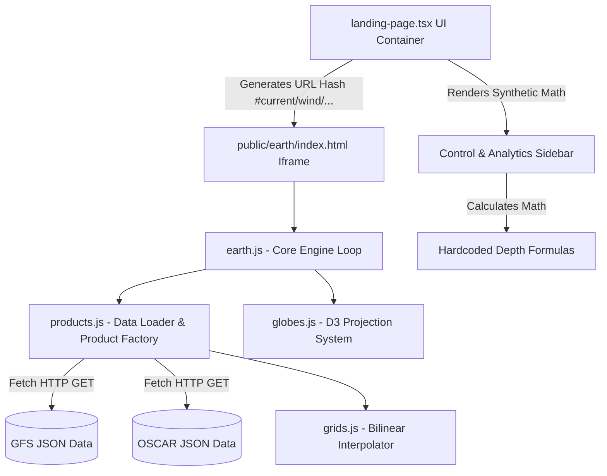

# Leher Scientific Data Architecture: Repository Data Audit (Phase 1)

**Project:** Leher 3D Ocean Intelligence Workbench  
**Audit Date:** September 3, 2026  
**Auditor:** Lead Data & Scientific Visualization Engineer  

---

## 1. Existing Datasets

| Dataset Name | Source / Provider | Storage Path | Description |
| :--- | :--- | :--- | :--- |
| **GFS Atmospheric Wind** | US NWS - NCEP (WMC) | `public/earth/data/weather/current/current-wind-surface-level-gfs-1.0.json` | 10m height surface level vector wind components (U and V velocity). |
| **OSCAR Surface Ocean Currents** | Earth & Space Research (ESR) | `public/earth/data/oscar/20140131-surface-currents-oscar-0.33.json` | 15m depth ocean surface current vector velocity components (U and V current). |
| **OSCAR Catalog Manifest** | Local Catalog | `public/earth/data/oscar/catalog.json` | JSON index file listing available OSCAR snapshot filenames. |

---

## 2. Dataset Formats

All visualizable datasets in the engine use a custom **GRIB-derived 2D JSON Array Schema**:
- **Root Element:** Array of parameter record objects (`[{ header: {...}, data: [...] }, ...]`).
- **Header Object:** Contains grid dimensions, bounding box, spatial step size, and parameter category metadata:
  - `discipline`: NCEP GRIB discipline code (0 = Meteorological, 10 = Oceanographic)
  - `parameterCategory`: Parameter category identifier
  - `parameterNumber`: Parameter record type (e.g., 2 = U-component, 3 = V-component)
  - `nx`, `ny`: Grid column and row counts
  - `lo1`, `la1`, `lo2`, `la2`: Extents (Longitude start, Latitude start, Longitude end, Latitude end)
  - `dx`, `dy`: Horizontal spatial resolution step size in degrees
  - `refTime`: ISO 8601 UTC timestamp of dataset measurement/forecast
- **Data Array:** 1D flattened array of floats representing grid values stored in row-major order (from `la1` to `la2` and `lo1` to `lo2`). Missing/land mask cells are stored as `null`.
- **Compression:** HTTP assets are optionally pre-gzipped (`.json.gz`).

---

## 3. Dataset Resolution

| Variable | Grid Dimensions ($NX \times NY$) | Total Points | Horizontal Resolution ($\Delta\lambda \times \Delta\phi$) | Spatial Extent |
| :--- | :--- | :--- | :--- | :--- |
| **GFS Wind (1.0°)** | $360 \times 181$ | 65,160 | $1.0^\circ \times 1.0^\circ$ | $0^\circ\text{E} \rightarrow 359^\circ\text{E}$, $90^\circ\text{N} \rightarrow -90^\circ\text{S}$ |
| **OSCAR Currents (0.33°)** | $1080 \times 481$ | 519,480 | $0.333^\circ \times 0.333^\circ$ | $20^\circ\text{E} \rightarrow 379.67^\circ\text{E}$, $80^\circ\text{N} \rightarrow -80^\circ\text{S}$ |

---

## 4. Dataset Timestamps

- **GFS Wind Reference Time:** `2014-01-31T00:00:00.000Z` (Forecast hour +3). *Static legacy snapshot.*
- **OSCAR Currents Reference Time:** `2014-01-31T00:00:00.000Z`. *Static legacy snapshot.*

---

## 5. Scientific Fields Currently Rendered

1. **Atmospheric Wind Velocity Field ($\mathbf{u}_{wind}$):**
   - Vector components: $U$ (Eastward wind, $m/s$) and $V$ (Northward wind, $m/s$).
   - Altitude: 10 meters above ground level.
   - Rendered as particle flow vectors and color-mapped magnitude overlay ($|\mathbf{u}| = \sqrt{u^2 + v^2}$).
2. **Ocean Surface Current Velocity Field ($\mathbf{u}_{current}$):**
   - Vector components: $U$ (Eastward ocean current, $m/s$) and $V$ (Northward ocean current, $m/s$).
   - Depth: 15 meters below sea level.
   - Rendered as particle flow streamlets and ocean velocity magnitude overlay.

---

## 6. Synthetic Values, Hardcoded Calculations & Placeholder Formulas

The following synthetic calculations and hardcoded mock data were identified across the repository:

### A. Frontend Workbench UI (`src/components/ui/landing-page.tsx`)
1. **Depth-Based Synthetic Water Column Model:**
   ```typescript
   // Lines 80-87: Hardcoded linear formulas calculating fake hydrographic values from depth
   const modelValues = {
     temperature: (28.5 - selectedDepth * 0.045).toFixed(2),
     salinity: (35.2 + selectedDepth * 0.002).toFixed(2),
     chlorophyll: (1.4 - selectedDepth * 0.002).toFixed(3),
     turbidity: (2.1 - selectedDepth * 0.003).toFixed(2)
   };
   ```
2. **Synthetic Telemetry Observation (Argo Float #2902345):**
   ```typescript
   // Lines 930-945, 1147-1165: Hardcoded observed values and synthetic model-observation anomaly
   const observedValues = {
     temperature: (28.1 - selectedDepth * 0.042).toFixed(2),
     salinity: (35.4 + selectedDepth * 0.0018).toFixed(2),
     chlorophyll: (1.3 - selectedDepth * 0.0019).toFixed(3)
   };
   ```
3. **Hardcoded Deep Water Layer Cards:**
   - Static depth presets: `Surface (0m)`, `Thermocline (200m)`, `Deep Water (1000m)`, `Abyssal (4000m)` with synthetic readings.
4. **Static Sensor Metadata:**
   - Hardcoded `"Argo Float #2902345"` identification number.
   - Hardcoded `"Last Sync: 12 mins ago"` relative timestamp string.

### B. Legacy Canvas Rendering Engine (`public/earth/libs/earth/1.0.0/products.js`)
1. **Static Overlay Color Scales:**
   - Hardcoded RGB color stop arrays for wind velocity ($0\text{ m/s} \rightarrow 100\text{ m/s}$) and ocean velocity ($0\text{ m/s} \rightarrow 1.5\text{ m/s}$).
2. **Null Value Masking:**
   - Hardcoded replacement of land mask `null` grid entries with `0` or transparent alpha pixels (`rgba(0,0,0,0)`).

---

## 7. Component-by-Component Data Dependency Map



### Component Details
1. **`src/components/ui/landing-page.tsx`**
   - **Role:** Main Application Workbench & State Orchestrator.
   - **Input Data Dependencies:** UI State (`workbenchMode`, `selectedDepth`, `workbenchProjection`, `selectedParam`).
   - **Output Data Dependencies:** Iframe URL Hash query parameters (`#current/wind/surface/level/orthographic=...`).
2. **`public/earth/libs/earth/1.0.0/earth.js`**
   - **Role:** Rendering Pipeline & Animation Controller.
   - **Data Input:** Hash state, grid arrays from `products.js`.
   - **Output:** HTML5 Canvas particle animation & overlay rendering loop.
3. **`public/earth/libs/earth/1.0.0/products.js`**
   - **Role:** Data Retrieval & Scientific Factory.
   - **Data Input:** JSON files from `/public/earth/data/`.
   - **Data Processing:** Parses NCEP GRIB headers, extracts U/V arrays, constructs bilinear grid interpolators (`grids.js`).
4. **`public/earth/libs/earth/1.0.0/grids.js`**
   - **Role:** Spatial Grid Interpolator.
   - **Input:** 1D array of grid values, target $(\lambda, \phi)$ coordinates.
   - **Output:** Interpolated vector/scalar values $(u, v)$ for screen-space rendering.
