# LEHER — SIH Problem Statement 26067: Implementation Gap Analysis & Roadmap

**Problem Statement ID**: 26067  
**Problem Statement Title**: Develop a web-based interactive 3D visualization platform that integrates numerical ocean model outputs and in-situ observations  
**Ministry / Department**: Ministry of Earth Sciences (MoES) / Indian National Centre for Ocean Information Services (INCOIS), Ocean Valley  
**Theme**: Disaster Management  
**Category**: Software  
**Audit Date**: September 2026  
**Audited Codebase**: LEHER (`DNA-Coded/LEHER`)

---

## 1. Executive Summary & Objective

The objective of **SIH PS 26067** is to eliminate the historic fragmentation in Indian operational oceanography—where forecasters must toggle between desktop-bound software (ODV, Ferret), 2D horizontal web portals, and raw text/NetCDF files—by building a **browser-native, platform-independent 3D Ocean Intelligence System**.

This document provides a rigorous, honest, point-by-point audit comparing the **exact requirements of Problem Statement 26067** against what is **currently implemented**, what is **simulated / mocked / partially built**, and what is **completely left to implement** in both the **Frontend** and **Backend**.

---

## 2. Master Status & Compliance Matrix

| # | PS 26067 Core Requirement | Frontend Implementation Status | Backend Implementation Status | Overall Readiness | Key Remaining Work |
|:---:|---|---|---|:---:|---|
| **1** | **3D Volumetric Rendering** Depth-resolved water column (0–2000m), depth-slice views, isosurface extraction, time-step animation via WebGL/Three.js or Cesium.js | ✅ **Implemented** (Three.js vertical cylinder & cuboid soundings, depth slider) ⚠️ **Stubbed** (Isosurface extraction Web Worker is an empty mock) ⚠️ **Simulated** (4-season loop instead of temporal NetCDF playback) | ✅ **Implemented** (`/api/v1/model/slices` and `/api/v1/vectors/slices` via Apache Arrow) ⚠️ **Missing** (Full 3D volume cube / voxel buffer endpoint) | **65%** | • Real Marching Cubes algorithm in Web Worker • Dynamic time-step animation querying model timestamps • True 3D volumetric block/layer on Cesium globe |
| **2** | **Instrument Data Overlay** Geospatially accurate markers for Argo floats, Gliders, CTD, and BGC; clickable inspect modal with depth-vs-variable profile chart and timestamps | ✅ **Implemented** (`InSituSensorModal`, 16 curated platforms, SVG depth curves, drift track) ❌ **Missing on Globe** (Cesium globe only renders 7 mock Argo floats; gliders, buoys, and BGC are missing from globe) | ❌ **Completely Missing** (No database, no ingestion pipeline, and no API router for Argo, Gliders, CTDs, or BGC) | **40%** | • Backend Argo GDAC & Glider parser • `/api/v1/instruments` REST API • Co-display gliders, OMNI buoys, and BGC markers on Cesium 3D Globe |
| **3** | **Model vs. Observation Co-Visualization & Bias Engine** Simultaneously co-render model fields and in-situ observations to correlate predictions with evidence | ✅ **Implemented** (`ModelVsObsComparator.tsx`, dual sounding curves, signed anomaly bars, RMSE, mean bias, dMLD, D20 error, Pearson $r$) | ⚠️ **Indirect** (Comparison math executed client-side; backend does not have a dedicated spatial-temporal collocation endpoint) | **80%** | • Backend spatial-temporal nearest-neighbor collocation endpoint (`/api/v1/instruments/comparison`) |
| **4** | **Multi-Format Data Ingestion** Automated parsers for NetCDF (via PyNIO / xarray backend) and delimited text formats; modular architecture for minimal-code variable addition | ⚠️ **Partial** (Frontend parses Arrow IPC streams; legacy service references 404 endpoints) | ✅ **Implemented** (`xarray` + `zarr` for GLORYS NetCDF, DuckDB catalog, Arrow IPC) ❌ **Missing** (PyNIO backend, FTP crawler, ASCII/delimited text in-situ parser) | **60%** | • Automated FTP harvester for Argo & Glider NetCDF/ASCII • Generic delimited text (CSV/TSV) observation parser • Ingestion for INCOIS LAS feeds |
| **5** | **Customizable Colorbar & Variable Controls** Dynamic colorbar editor (color palette, min/max range, log/linear scale), variable selector, layer opacity, vertical exaggeration | ✅ **Implemented** (8 colormaps, opacity slider, exaggeration slider, variable selector) ❌ **Missing** (Log/linear scale switch, custom min/max bound inputs) | ✅ **Implemented** (Dynamic physical range returned via HTTP headers `X-Data-Min`, `X-Data-Max`) | **75%** | • Functional Logarithmic vs. Linear colorbar toggle • Interactive colorbar bounds editor (user-adjustable stops & clamps) |
| **6** | **Web-Based, Scalable Architecture** Modern JS frontend, lightweight REST/OPeNDAP backend, deployment on INCOIS infrastructure without client dependencies | ✅ **Implemented** (React 19 + Vite + TypeScript + Three.js + Cesium.js; 100% browser-native) | ✅ **Implemented** (FastAPI async microservice + DuckDB + Apache Arrow IPC) ❌ **Missing** (OPeNDAP DAP2/DAP4 protocol server) | **80%** | • OPeNDAP DAP endpoint or integration • Fix disconnected endpoints in `frontend/src/lib/api/oceanDataService.ts` |
| **7** | **Extensible Design for Future Sensors** Plugin-style module for CTDs, moorings, HF-radar, ADCP, new variables, and ML products | ⚠️ **Partial** (Frontend data model supports sensor types, but no UI to register new feeds) | ⚠️ **Partial** (`plugins/copernicus` works; `plugins/argo` is an empty stub; no HF-radar or ADCP plugins) | **50%** | • Implement active `plugins/argo` and `plugins/glider` • Create template plugin for HF-Radar and ADCP bin data • Dynamic sensor registration endpoint |
| **8** | **Open Standards & Interoperability** OGC WMS/WCS standards, NetCDF CF conventions | ⚠️ **Partial** (OGC GeoJSON hazard polygons and safe zones) | ✅ **Implemented** (CF-1.8 coordinate conventions in Zarr) ❌ **Missing** (OGC WMS `GetMap` & OGC WCS `GetCoverage` server endpoints) | **45%** | • OGC WMS endpoint (`/api/v1/ogc/wms`) returning tile images • OGC WCS endpoint (`/api/v1/ogc/wcs`) returning coverage grids |
| **9** | **Operational Mandates (Disaster Management)** Hazard assessment, search-and-rescue (SAR), fishery advisories, climate monitoring | ✅ **Implemented** (Hazard overlays, Fishermen Safe Corridors, Ecosystem 4,000 cells, Mission Dossier PDF) | ✅ **Implemented** (Trained XGBoost models for cyclone probability & storm surge height, voice advisories) | **85%** | • Interactive Search and Rescue (SAR) drift trajectory simulator (surface leeway + current drift over 12–48h) |
| **10** | **Public Outreach & Science Communication** Transform complex 3D numerical model outputs into intuitive experiences for students, public, policymakers | ✅ **Implemented** (`AboutLeherPage` with educational physics cards, client-side Mission Dossier PDF generator) | N/A (Frontend responsibility) | **90%** | • Interactive 1-click guided educational story tour • Regional language translations (Hindi, Tamil, etc.) for alerts |
| **11** | **Mandatory Dataset Links (Page 4)** INCOIS LAS, Copernicus GLORYS12V1, Argo Global FTP, Glider FTP, In-Situ collections | ⚠️ **Partial** (GLORYS sample data ingested; others hardcoded or referenced in docs only) | ⚠️ **Partial** (GLORYS reanalysis 3-day sample in Zarr; FTP data sources not connected live) | **40%** | • Connect live or offline-cached datasets from all 4 mandatory links on Page 4 |

---

## 3. Detailed Audit: What is Already Implemented

### 3.1. Frontend Implemented Features

1. **3D Water Column Sounding Visualization (Three.js WebGL)**:
   - Located in [`DepthSliceStandalone.tsx`](file:///c:/Users/Arya%20Bhagat/Desktop/Sih/FR/frontend/src/components/ocean/depth-slice/DepthSliceStandalone.tsx) and [`depth-slice-page.tsx`](file:///c:/Users/Arya%20Bhagat/Desktop/Sih/FR/frontend/src/components/ui/depth-slice-page.tsx).
   - **Dual 3D Geometries**:
     - *Stratified Cylinder*: Vertical core soundings showing depth layers with internal depth markers.
     - *Stratified Cuboid*: Oceanographic volumetric grid block.
   - **Interactive Depth Navigation**: Continuous depth slider from surface (0m) to abyss (2,000m) with 4 tactical presets (Surface 0m, Thermocline 100m, Intermediate 500m, Abyss 2,000m).
   - **Vertical Exaggeration**: Granular slider from 50x to 300x for intuitive bathymetric depth perception.
   - **Layer Opacity**: 0% to 100% slider.
   - **3D Vector Compass & Orientation**: Displays current direction heading in degrees and cardinal points.
   - **Scientific Colormaps**: 8 colormaps (Viridis, Turbo, Plasma, Thermal, Coolwarm, Haline, Salinity, Chlorophyll).

2. **In-Situ Observation Overlay & Inspection (Client-Side)**:
   - Located in [`InSituSensorModal.tsx`](file:///c:/Users/Arya%20Bhagat/Desktop/Sih/FR/frontend/src/components/ocean/InSituSensorModal.tsx) and [`inSituSensorData.ts`](file:///c:/Users/Arya%20Bhagat/Desktop/Sih/FR/frontend/src/services/inSituSensorData.ts).
   - **16 Curated Physical Platforms**:
     - 8 Argo Profiling Floats (0–2,000m depth profiles).
     - 2 Underwater Autonomous Gliders (sawtooth dive profiles, chlorophyll).
     - 4 INCOIS OMNI Moored Buoys (surface met stations + 500m thermistor chains).
     - 2 Biogeochemical (BGC) Profilers (Dissolved Oxygen & Nitrate in Oxygen Minimum Zones).
   - **Telemetry & Inspection Cards**: Battery voltage, WMO ID, QC status flags (`1 - Good`, `2 - Probably Good`), satellite ping timestamps, and multi-day drift track history (0, 10, 20, 30 days).
   - **Interactive SVG Profiles**: High-resolution depth-vs-variable curves with cursor crosshairs.

3. **Model vs. Observation Hydrodynamic Bias Engine**:
   - Located in [`ModelVsObsComparator.tsx`](file:///c:/Users/Arya%20Bhagat/Desktop/Sih/FR/frontend/src/components/ocean/ModelVsObsComparator.tsx) and [`anomalyEngine.ts`](file:///c:/Users/Arya%20Bhagat/Desktop/Sih/FR/frontend/src/lib/ocean/anomalyEngine.ts).
   - Co-renders numerical model profile against in-situ profile.
   - Computes live oceanographic validation KPIs:
     - Water Column RMSE ($^\circ\text{C}$ / PSU).
     - Mean Bias ($\Delta T, \Delta S$).
     - Mixed Layer Depth anomaly ($\Delta\text{MLD}$ via $0.2^\circ\text{C}$ criterion).
     - D20 Thermocline Depth error ($20^\circ\text{C}$ isotherm).
     - Pearson Correlation Coefficient ($r$).
   - Dual-sided signed anomaly bar chart (cyan cold/fresh bias vs rose warm/saline bias).
   - Automated oceanographic and tactical naval acoustic narratives.

4. **Dedicated Off-Thread Web Workers**:
   - Located in [`frontend/src/workers/`](file:///c:/Users/Arya%20Bhagat/Desktop/Sih/FR/frontend/src/workers/).
   - `sliceDecoder.worker.ts`: Decodes binary Apache Arrow IPC streams off the main thread.
   - `vectorProcessor.worker.ts`: Filters, decimates, and computes velocity vectors off-thread.

5. **Operational Decision Support & Hazard Analytics**:
   - Located in [`operations-page.tsx`](file:///c:/Users/Arya%20Bhagat/Desktop/Sih/FR/frontend/src/components/ui/operations-page.tsx) and [`details-page.tsx`](file:///c:/Users/Arya%20Bhagat/Desktop/Sih/FR/frontend/src/components/ui/details-page.tsx).
   - Displays real-time Rakshak hazard warnings (Cyclones, Coastal Surges, Extreme Tides).
   - Displays 4,000 spatial cells for Marine Ecosystem health (Coral Bleaching, Algal Blooms, Hypoxia dead zones).
   - Displays Fishermen Safe Corridors (Safe, Caution, Prohibited).

6. **Public Outreach & Executive Reporting**:
   - Located in [`about-page.tsx`](file:///c:/Users/Arya%20Bhagat/Desktop/Sih/FR/frontend/src/components/ui/about-page.tsx) and [`missionDossierPdf.ts`](file:///c:/Users/Arya%20Bhagat/Desktop/Sih/FR/frontend/src/lib/export/missionDossierPdf.ts).
   - Interactive educational cards translating thermoclines, barrier layers, and SOFAR channels into accessible visual graphics.
   - Client-side print-ready Mission Dossier PDF generation with MoES / INCOIS styling.

---

### 3.2. Backend Implemented Features

1. **High-Speed FastAPI Asynchronous Microservice**:
   - Located in [`backend/apps/api/leher/main.py`](file:///c:/Users/Arya%20Bhagat/Desktop/Sih/FR/backend/apps/api/leher/main.py).
   - CORS middleware with exposed custom metadata headers.
   - Automated lifespan hooks with DuckDB connection management.
   - APScheduler background scheduler executing hourly ML scans.
   - Interactive OpenAPI 3.0 / Swagger documentation at `/api/docs`.

2. **Copernicus GLORYS12V1 Zarr Data Fabric**:
   - Located in [`backend/fabric/datasets/glorys/v20240101/`](file:///c:/Users/Arya%20Bhagat/Desktop/Sih/FR/backend/fabric/datasets/glorys/v20240101/).
   - Multi-dimensional Zarr stores: `temperature.zarr`, `salinity.zarr`, `uo.zarr`, `vo.zarr`, `current_speed.zarr`, `chlorophyll.zarr`.
   - `manifest.json` indexing 15 standard depth levels (0.49m to 2,000m) and temporal boundaries.
   - Climate and Forecast (CF-1.8) coordinate compliance (`time`, `depth`, `latitude`, `longitude`).

3. **Zero-Copy Apache Arrow IPC Streaming Endpoints**:
   - Located in [`slices.py`](file:///c:/Users/Arya%20Bhagat/Desktop/Sih/FR/backend/apps/api/leher/routers/slices.py) and [`vectors.py`](file:///c:/Users/Arya%20Bhagat/Desktop/Sih/FR/backend/apps/api/leher/routers/vectors.py).
   - `/api/v1/model/slices`: Slices 4D Zarr volumes at requested `depth_m`, `time`, and bounding box; encodes directly to `application/vnd.apache.arrow.stream`.
   - `/api/v1/vectors/slices`: Extracts and serializes eastward/northward velocities $(u, v)$ as Arrow IPC tables.
   - HTTP response headers provide dynamic min/max bounds (`X-Data-Min`, `X-Data-Max`), selected time, and depth.
   - In-memory TTL cache preventing repetitive disk reads.

4. **In-Memory DuckDB Analytical Metadata Catalog**:
   - Located in [`catalog.py`](file:///c:/Users/Arya%20Bhagat/Desktop/Sih/FR/backend/services/jal-chakra/core/catalog.py).
   - Indexes all available datasets, depth layers, variables, and temporal availability.
   - Serves metadata endpoints: `/api/v1/catalog/datasets`, `/api/v1/catalog/variables`, `/api/v1/catalog/depths`.

5. **Jal-Chakra Ingestion Engine (Copernicus / GLORYS Pipeline)**:
   - Located in [`backend/services/jal-chakra/`](file:///c:/Users/Arya%20Bhagat/Desktop/Sih/FR/backend/services/jal-chakra/).
   - 4-stage pipeline: **Utpatti** (acquire), **Pariksha** (validate with xarray), **Rupantar** (convert to Zarr chunks), **Prakashan** (publish manifest).
   - Automated Copernicus Marine client (`copernicusmarine` API).

6. **Rakshak Machine Learning & Operational Hazard Suite**:
   - Located in [`rakshak.py`](file:///c:/Users/Arya%20Bhagat/Desktop/Sih/FR/backend/services/jal-chakra/core/rakshak.py) and [`backend/fabric/ml/`](file:///c:/Users/Arya%20Bhagat/Desktop/Sih/FR/backend/fabric/ml/).
   - Trained XGBoost models (`surge_model.json`, `anomaly_model.json`) for storm surge heights and cyclone genesis.
   - Safe zone generator (`safe_zones.py`) producing GeoJSON polygons based on current energy and depth.
   - Ecosystem health calculator (`ecosystem.py`) tracking 4,000 spatial cells for Coral Bleaching (DHW), Algal Blooms, and Hypoxia.
   - Automated maritime radio voice advisory generator (`voice_advisory.py`).

---

## 4. What is Left to Implement in Frontend

### 4.1. Core 3D Rendering & WebGL Gaps
- [ ] **Implement Real Marching Cubes in `isosurface.worker.ts`**:
  - *Current State*: Currently a mock/stub that returns placeholder triangle soup with the comment `// Clean architectural mock/stub generating sample triangle soup for the thermocline layer`.
  - *Required*: Implement the true 3D Marching Cubes or Marching Tetrahedra algorithm that consumes a 3D scalar Float32Array volume grid and generates watertight triangle meshes with vertex normals for requested isovalues (e.g., $20^\circ\text{C}$ thermocline surface or $35\,\text{PSU}$ halocline surface).
  - *Render*: Render the extracted isosurface mesh inside Three.js as a semi-transparent undulating 3D sheet across the Indian Ocean basin.

- [ ] **Wire the Cesium 3D Globe with All Observation Sensors**:
  - *Current State*: The main Cesium globe component ([`OceanGlobe.tsx`](file:///c:/Users/Arya%20Bhagat/Desktop/Sih/FR/frontend/src/components/ocean/OceanGlobe.tsx)) is isolated in [`OceanAnalysis.tsx`](file:///c:/Users/Arya%20Bhagat/Desktop/Sih/FR/frontend/src/components/ocean/OceanAnalysis.tsx) (which is unrouted in `App.tsx`), while `OperationsPage` embeds a 2D iframe (`/earth/index.html`). On the Cesium globe itself, only 7 mock Argo floats are plotted.
  - *Required*:
    1. Render all 16 physical in-situ platforms (Argo floats, underwater gliders, OMNI buoys, and BGC sensors) as distinct 3D billboards on the Cesium globe.
    2. Add interactive click handlers on the globe markers that immediately pop up the sensor inspection card and launch the Model vs. Observation comparison.
    3. Co-render the dynamic safe fishing corridors (`safe_zones.geojson`) directly on the 3D globe.

- [ ] **Dynamic NetCDF Temporal Timeline Player**:
  - *Current State*: The seasonal animation in `depth-slice-page.tsx` is a hardcoded 4-season loop ("Pre-Monsoon", "SW Monsoon", "Post-Monsoon", "NE Monsoon") using client-side simulated data shifts.
  - *Required*: A timeline control bar that steps through actual model timestamps (e.g. 24-hour time steps from backend Zarr/NetCDF), fetching real temporal slices asynchronously and interpolating smooth transitions.

### 4.2. Customizable Colorbar & Scaling Gaps
- [ ] **Logarithmic vs. Linear Colorbar Toggle**:
  - *Current State*: The problem statement specifies: *"Dynamic colorbar editor (color palette, min/max range, log/linear scale)"*. While colormaps and linear gradients exist, log scaling is completely absent from the UI and color interpolation functions.
  - *Required*:
    1. Add a `Linear | Logarithmic` toggle button in the colorbar toolbar.
    2. Implement logarithmic mapping: $t_{\text{norm}} = \frac{\log_{10}(v) - \log_{10}(v_{\min})}{\log_{10}(v_{\max}) - \log_{10}(v_{\min})}$.
    3. Essential for **Chlorophyll-a** (which spans $0.01$ to $>10\,\text{mg/m}^3$) and **Current kinetic energy**.

- [ ] **Interactive Dynamic Min/Max Bounds Editor**:
  - *Current State*: Min and max bounds are either static defaults or read-only from response headers.
  - *Required*: Allow the user to click the min/max labels to enter custom range clamps (e.g., clamp SST between $24^\circ\text{C}$ and $31^\circ\text{C}$ to highlight thermal fronts).

### 4.3. Service Wiring & Deprecated Fallback Fixes
- [ ] **Re-route Disconnected Frontend API Calls**:
  - *Current State*: In [`oceanDataService.ts`](file:///c:/Users/Arya%20Bhagat/Desktop/Sih/FR/frontend/src/lib/api/oceanDataService.ts), methods attempt to fetch `/api/ocean/temperature`, `/api/ocean/salinity`, and `/api/incois/opendap/subset`. These endpoints do not exist in the backend, causing immediate 404s and forcing the frontend into client-side mathematical fallbacks.
  - *Required*: Standardize all frontend data fetching to use [`oceanApi.ts`](file:///c:/Users/Arya%20Bhagat/Desktop/Sih/FR/frontend/src/services/oceanApi.ts) and `/api/v1/model/slices`, `/api/v1/vectors/slices`, and the new `/api/v1/instruments` router.

---

## 5. What is Left to Implement in Backend

### 5.1. In-Situ Observation Ingestion & Storage
- [ ] **Argo GDAC NetCDF Ingestion Pipeline**:
  - *Current State*: Directory [`backend/services/jal-chakra/plugins/argo`](file:///c:/Users/Arya%20Bhagat/Desktop/Sih/FR/backend/services/jal-chakra/plugins/argo/) only contains an empty `__init__.py`. In `catalog.py`, the system prints `"[CATALOG] No Argo profiles yet"`.
  - *Required*:
    1. Build an automated downloader/crawler for the official Argo GDAC FTP: `ftp://ftp.ifremer.fr/ifremer/argo` (as listed on Page 4 of the PS).
    2. Parse the multi-profile NetCDF files extracting: WMO ID, platform cycle number, latitude, longitude, timestamp, depth/pressure levels, `TEMP`, `PSAL`, and `TEMP_QC` / `PSAL_QC`.
    3. Store validated profiles (`QC == 1` or `QC == 2`) into `backend/fabric/datasets/argo/profiles.parquet`.

- [ ] **Underwater Glider NetCDF & ASCII Ingestion**:
  - *Current State*: No glider ingestion module exists.
  - *Required*:
    1. Connect to OceanGliders Global Repository: `ftp://ftp.ifremer.fr/ifremer/glider/v2/` (PS Page 4).
    2. Parse high-resolution sawtooth dive-climb trajectories (depth, temperature, salinity, chlorophyll fluorescence, dissolved oxygen).
    3. Store parsed transects into `backend/fabric/datasets/gliders/dives.parquet`.

- [ ] **Dedicated In-Situ Observation API Router (`/api/v1/instruments`)**:
  - *Current State*: The backend has no router serving in-situ platforms.
  - *Required*: Add `backend/apps/api/leher/routers/instruments.py` providing:
    - `GET /api/v1/instruments/platforms`: Returns all active Argo, Glider, OMNI Buoy, and BGC sensors in the Indian Ocean.
    - `GET /api/v1/instruments/{platform_id}/profile`: Returns the depth-vs-variable profile curve with QC flags and timestamps.
    - `GET /api/v1/instruments/{platform_id}/drift`: Returns the historical drift path coordinates.
    - `GET /api/v1/instruments/comparison`: Performs server-side spatial-temporal nearest-neighbor matching between model grid cells and the platform's sounding.

### 5.2. Open Standards & Interoperability (OGC & OPeNDAP)
- [ ] **OGC WMS / WCS Server Implementation**:
  - *Current State*: The PS explicitly mandates: *"The system will follow open standards (OGC WMS/WCS, CF Conventions for NetCDF), enabling interoperability with national and international ocean data portals."* Currently, no WMS or WCS endpoints exist in FastAPI.
  - *Required*:
    1. `GET /api/v1/ogc/wms?SERVICE=WMS&REQUEST=GetCapabilities`: Returns standard XML capabilities describing available ocean layers.
    2. `GET /api/v1/ogc/wms?SERVICE=WMS&REQUEST=GetMap&LAYERS=...&BBOX=...&WIDTH=...&HEIGHT=...&FORMAT=image/png`: Dynamically renders georeferenced raster tiles from Zarr model slices with the requested colormap.
    3. `GET /api/v1/ogc/wcs?SERVICE=WCS&REQUEST=GetCoverage`: Streams raw gridded data subsets as GeoTIFF or NetCDF.

- [ ] **Lightweight OPeNDAP / DAP2 Protocol Server**:
  - *Current State*: The PS specifies: *"lightweight REST/OPeNDAP API backend"*. Only REST is currently implemented.
  - *Required*: Implement lightweight DAP endpoints (`.dds` for dataset descriptor structure, `.das` for dataset attribute structure, `.dods` for binary data stream) using `pydap` or an asynchronous xarray DAP responder so oceanographers can open LEHER data directly in desktop tools (Panoply, ODV, MATLAB, QGIS).

### 5.3. External Dataset Connectors (Page 4 Links)
- [ ] **INCOIS Live Access Server (LAS) Connector**:
  - *Current State*: The PS lists `https://las.incois.gov.in/` as a required numerical model source.
  - *Required*: Script an automated THREDDS/OPeNDAP harvester that queries INCOIS LAS for regional high-resolution ROMS forecasts (temperature, salinity, currents) and indexes them into Jal-Chakra.

### 5.4. Search-and-Rescue (SAR) Drift Prediction Engine
- [ ] **Lagrangian Surface Drift Particle Engine**:
  - *Current State*: The PS states: *"timely hazard assessment, search-and-rescue support, fishery advisories"*. While fishery safe zones and cyclone surge models are implemented, SAR drift modeling is not.
  - *Required*: Implement a 2D/3D Lagrangian particle trajectory simulation endpoint (`/api/v1/ml/sar/drift`) using surface current vectors $(u, v)$ and 10m wind leeway to predict the probability dispersion cone of a missing vessel or object over 12, 24, and 48 hours.

---

## 6. Key Points & Subtleties Missed from Problem Statement 26067

1. **"Simultaneously Render Model Fields and In-Situ Observations in a Single Interactive Environment"**:
   - The PS emphasizes co-visualization as the primary operational gap. Currently, the 3D depth-slice sounding viewer, the in-situ modal, and the Cesium globe operate in separate silos. They should be seamlessly unified on the primary 3D viewport.

2. **PyNIO Explicitly Mentioned**:
   - The PS text states: *"Automated parsers for NetCDF (via PyNIO / xarray backend)"*. While `xarray` is implemented, PyNIO was historically used by NCAR. Because PyNIO is deprecated on modern Python, the backend should explicitly document how `xarray + netCDF4 + h5netcdf` fulfills this requirement with full CF-convention compatibility.

3. **All 4 Mandatory Datasets from Page 4 Must Be Traceable**:
   - The PS explicitly lists:
     - `a. Numerical Ocean Model Outputs: https://las.incois.gov.in/ & https://data.marine.copernicus.eu/`
     - `b. Argo Global Data: ftp://ftp.ifremer.fr/ifremer/argo`
     - `c. Glider Data: ftp://ftp.ifremer.fr/ifremer/glider/v2/`
     - `d. Collection of In-situ Data`
   - Currently, Copernicus GLORYS is partially present in Zarr, while the Argo FTP and Glider FTP links have not been connected to backend ingestion scripts.

4. **CTD and BGC Sensor Classes**:
   - Problem Statement core requirements specify: *"Co-display of Argo float, Glider profile, CTD and BGC data"*.
   - In addition to Argo floats (which carry CTDs), dedicated shipboard CTD casts and biogeochemical sensors (measuring Dissolved Oxygen, Nitrate, Chlorophyll-a) must have first-class representation in both the backend data schema and frontend inspection modals.

5. **Logarithmic Scaling for Biological Variables**:
   - Chlorophyll-a concentrations in the Arabian Sea and Bay of Bengal vary from $0.02\,\text{mg/m}^3$ (oligotrophic open ocean) to over $15\,\text{mg/m}^3$ (intense coastal phytoplankton bloom). A linear color ramp washes out all mesoscale structure. Logarithmic scaling is scientifically essential and explicitly demanded by the PS.

---

## 7. Actionable Implementation Plan & Priority Roadmap

To bring LEHER to 100% full compliance with SIH PS 26067, execute the following phased tasks:

```mermaid
graph TD
    subgraph Phase 1: Backend In-Situ Data Engine
        T1[Create plugins/argo & plugins/glider] --> T2[Parse FTP / Sample NetCDF & ASCII to Parquet]
        T2 --> T3[Implement /api/v1/instruments Router]
        T3 --> T4[Implement /api/v1/instruments/comparison Spatial Collocation]
    end

    subgraph Phase 2: Frontend 3D Globe & Sensor Unification
        T5[Mount Cesium OceanGlobe on Operations Page] --> T6[Render All 16 Sensors: Argo, Gliders, Buoys, BGC]
        T6 --> T7[Connect Globe Marker Clicks to Live API & ModelVsObsComparator]
        T7 --> T8[Add Logarithmic Scale Toggle to Colorbar Editor]
    end

    subgraph Phase 3: True 3D Volumetric Isosurfaces & Time Animation
        T9[Implement Marching Cubes in isosurface.worker.ts] --> T10[Render 3D 20°C Isotherm Surface in Three.js]
        T10 --> T11[Implement Dynamic NetCDF Time-Step Player]
    end

    subgraph Phase 4: Standards & Operational Deliverables
        T12[Implement OGC WMS GetMap Endpoint] --> T13[Add Search-and-Rescue SAR Drift Engine]
        T13 --> T14[Add INCOIS LAS OPeNDAP Connector]
    end
```

### Phase 1: Backend In-Situ Data Engine (High Priority)
1. **Develop `backend/services/jal-chakra/plugins/argo/`**:
   - Write `argo_parser.py` to parse NetCDF profile files into Polars DataFrames and export to `fabric/datasets/argo/profiles.parquet`.
2. **Develop `backend/services/jal-chakra/plugins/glider/`**:
   - Write `glider_parser.py` to parse glider dive profiles into `fabric/datasets/gliders/dives.parquet`.
3. **Add `/api/v1/instruments` FastAPI Router**:
   - Expose endpoints: `/platforms`, `/{id}/profile`, `/{id}/drift`, and `/comparison`.
4. **Wire DuckDB Catalog**:
   - Register `fabric/datasets/argo/*.parquet` and `fabric/datasets/gliders/*.parquet` in `catalog.py`.

### Phase 2: Frontend 3D Globe & Sensor Integration (High Priority)
1. **Unify the 3D Cesium Globe into `OperationsPage`**:
   - Replace the static 2D `/earth/index.html` iframe with the native Cesium.js globe ([`OceanGlobe.tsx`](file:///c:/Users/Arya%20Bhagat/Desktop/Sih/FR/frontend/src/components/ocean/OceanGlobe.tsx)).
2. **Add Multi-Category Sensor Billboards on the Globe**:
   - Plot Argo floats (cyan), Gliders (emerald), OMNI buoys (amber), and BGC floats (purple) with real-time ping labels.
3. **Connect Frontend to Live `/api/v1/instruments` Endpoints**:
   - Replace hardcoded `IN_SITU_SENSORS` with live data fetched via React Query, falling back gracefully if offline.
4. **Implement Logarithmic Scale Mode in Colorbar**:
   - Add the Log/Linear switch to `depth-slice-page.tsx` and implement the mathematical mapping in `colorScales.ts`.

### Phase 3: True 3D Volumetric Isosurfaces & Temporal Playback (Medium Priority)
1. **Implement 3D Marching Cubes in `isosurface.worker.ts`**:
   - Implement the Marching Cubes edge table and triangle lookup to generate real 3D isotherm/halocline meshes.
2. **Integrate Isosurface Mesh into Three.js Scene**:
   - Render the thermocline layer as an interactive 3D surface with customizable opacity.
3. **Build Dynamic NetCDF Time-Step Player**:
   - Replace the 4-season mock loop with continuous time-series navigation linked to backend time coordinates.

### Phase 4: Open Standards & Disaster Management Enhancements (Medium Priority)
1. **Implement OGC WMS Service**:
   - Add `/api/v1/ogc/wms` supporting `GetCapabilities` and `GetMap` for GIS interoperability.
2. **Implement Search-and-Rescue (SAR) Drift Predictor**:
   - Add a Lagrangian trajectory tool predicting drifting objects under current and wind forcing.
3. **Connect INCOIS LAS Catalog**:
   - Add an automated downloader or link builder for `https://las.incois.gov.in/`.

---

## 8. Summary Checklist for Hackathon Presentation

- [x] Web-based, platform-independent architecture (React + Vite + FastAPI).
- [x] 3D water column depth slicing (0–2000m) with Three.js.
- [x] Model vs. Observation bias engine (RMSE, bias, $\Delta\text{MLD}$, D20, Pearson $r$).
- [x] 8 scientific colormaps with vertical exaggeration (50x–300x).
- [x] Zero-copy Apache Arrow binary streaming for high-speed transfer.
- [x] ML operational hazard suite (cyclone genesis, storm surge, safe fishing corridors, ecosystem health).
- [x] Public outreach educational cards and Mission Dossier PDF generation.
- [ ] **NEXT TO FINISH**: Real Marching Cubes 3D isosurface mesh generation in Web Worker.
- [ ] **NEXT TO FINISH**: Backend `/api/v1/instruments` ingestion & API router for Argo, Gliders, CTDs, and BGC.
- [ ] **NEXT TO FINISH**: Direct display of all observation platforms on the interactive Cesium 3D Globe.
- [ ] **NEXT TO FINISH**: Logarithmic colorbar scaling mode.
- [ ] **NEXT TO FINISH**: OGC WMS/WCS endpoint compatibility.
