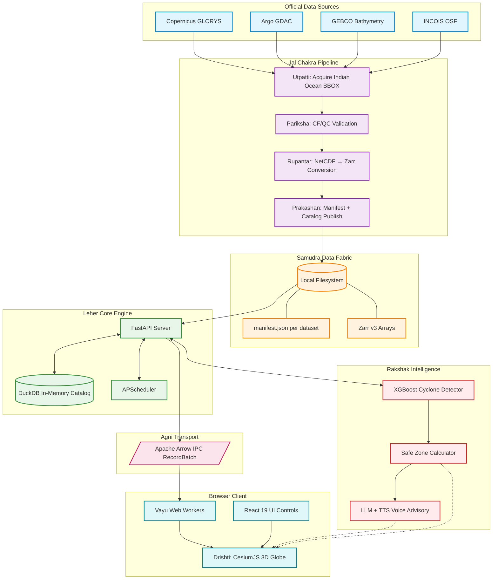
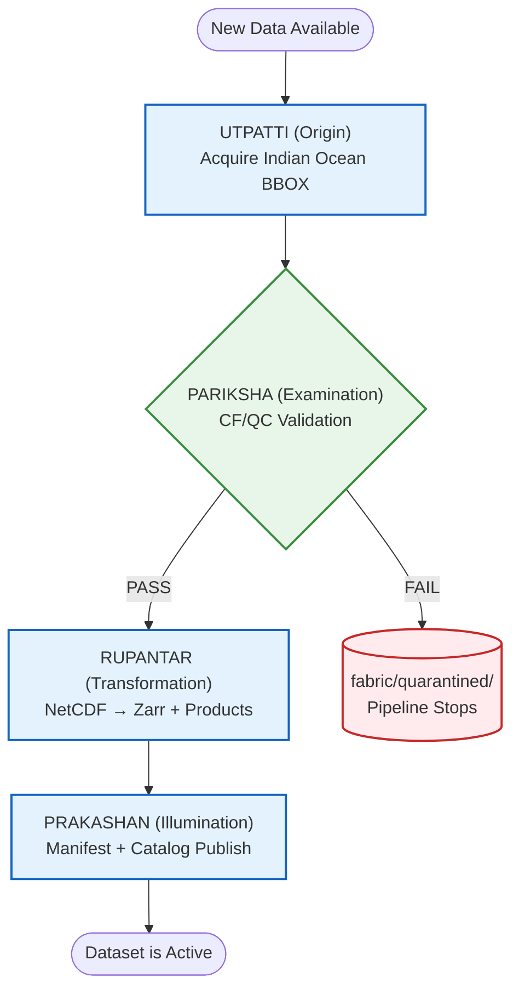
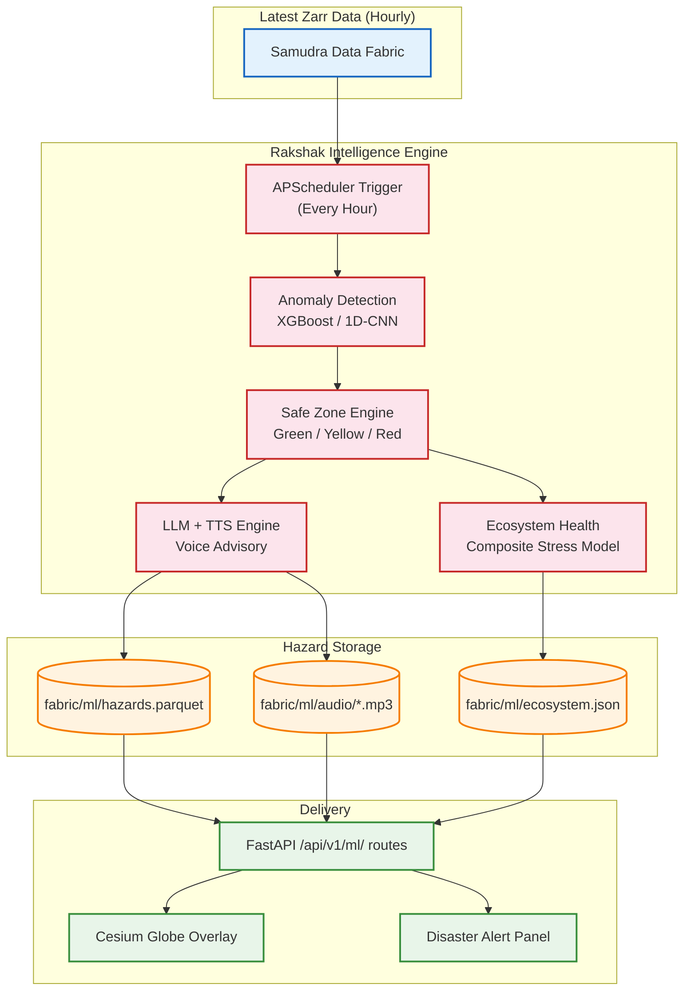

# Leher — Indigenous 3D Ocean Operations & Disaster Management Platform
### Version 2.0 | Problem Statement 26067 | INCOIS Ocean Visualization & Disaster Management Platform

---

## Table of Contents

1. Executive Summary
2. Problem Statement Analysis
3. System Vision and Design Philosophy
4. High-Level Architecture
5. Repository Structure and Monorepo Design
6. Data Sources and Scientific Background
7. Jal Chakra — The Data Ingestion Pipeline
8. Scientific Processing Layer (xarray + Polars)
9. Samudra Data Fabric (Local Filesystem Storage)
10. DuckDB Embedded Catalog
11. Scheduling and Async Tasks (APScheduler)
12. FastAPI Backend — Complete Specification
13. Agni Transport Layer (Apache Arrow IPC)
14. Vayu Web Worker Architecture
15. React Frontend Architecture
16. Drishti Render Engine (CesiumJS 3D)
17. GLSL Shader Design
18. Instrument Data Overlay (Argo + Gliders)
19. Colorbar and Variable Controls
20. Rakshak Intelligence — Disaster Management Module
21. Cyclone & Anomaly Detection Engine (XGBoost)
22. Fisherman Safe / Unsafe Zone Algorithm
23. Regional AI Voice Advisory System
24. Model vs. Observation Comparison
25. OGC Standards and Interoperability
26. Authentication and Authorization
27. Testing Strategy
28. Performance and Optimization
29. Monitoring and Observability
30. Deployment Strategy
31. Phase-Wise Execution Plan
32. Risk Analysis
33. Glossary

---

## 1. Executive Summary

Leher is a browser-native 3D ocean operations workspace, engineered entirely on an indigenous technology stack to address INCOIS Problem Statement 26067. It solves the lack of an integrated, platform-independent 3D visualization environment that can simultaneously render ocean model fields and in-situ observations.

Beyond meeting the base visualization requirements, Leher introduces **Rakshak Intelligence** — an ML-powered disaster management engine that processes ingested ocean data to detect cyclogenesis, compute fisherman safe zones, and deliver AI-generated voice advisories to coast guards and maritime operators in regional Indian languages.

The system is designed from first principles to be scientifically rigorous, meaning every value displayed on the 3D globe is directly traceable to a specific version of a validated, CF-compliant source dataset. Missing values are never coerced to zero. Depth conventions are always positive-down. Every ingestion event is immutable and versioned.

The architecture follows a strict separation of concerns:
- Scientific data lives on the local filesystem as Zarr arrays inside the **Samudra Data Fabric**
- Metadata and catalog queries are handled by an embedded **DuckDB** instance — no external database server
- The browser receives only the specific bounded subset it needs, encoded as a self-describing **Apache Arrow IPC** payload via the **Agni Transport Layer**
- All heavy computation runs off the main browser thread via **Vayu Web Workers**

The result is a platform that loads and renders a 3D Indian Ocean temperature depth-slice in under two seconds, is deployable on any machine with Python and Node.js, and requires zero cloud infrastructure.

---

## 2. Problem Statement Analysis

### 2.1 Official Problem Statement

Problem Statement ID: 26067
Issuing Organization: INCOIS (Indian National Centre for Ocean Information Services), MoES
Title: Develop a web-based interactive 3D visualization platform that integrates numerical ocean model outputs and in-situ observations.

### 2.2 Identified Gaps in Current Tools

The problem statement explicitly identifies five key operational gaps. Leher addresses each one:

**Gap 1: No web-based 3D rendering of depth-resolved ocean data**
Current tools are either desktop-bound (MATLAB, ODV) or limited to 2D plan views (Google Earth Engine, CMEMS viewer). Leher uses CesiumJS and WebGL 2.0 to render true volumetric depth-sliced layers directly in the browser without any installed software.

**Gap 2: No unified display of Argo and Glider profiles alongside model fields**
INCOIS forecasters are forced to open separate applications to view model output and then independently check Argo float profiles. Leher renders both on the same 3D globe. Clicking an Argo float marker opens a live Chart.js depth-vs-temperature profile generated from real-time data.

**Gap 3: Absence of interactive controls for variable selection, depth navigation, time animation**
Leher provides a full scientific control panel: variable selector (temperature, salinity, currents, chlorophyll), depth slider (0m to 5500m), time scrubber (stepping through model timesteps), colorbar editor, and opacity controls.

**Gap 4: Inability to ingest new data streams without re-engineering**
Leher's Jal Chakra pipeline uses a plugin-style adapter architecture. Adding support for a new instrument (e.g., HF-Radar, ADCP mooring) only requires writing a new Python adapter class that conforms to the standard interface. Zero modifications to the core pipeline are required.

**Gap 5: Lack of tools for rapid intuitive understanding of 3D ocean phenomena**
Leher's Rakshak Intelligence Layer transforms raw scientific numbers into actionable intelligence. A coast guard does not need to understand temperature gradients to use Leher. They see a red zone on the globe and hear an AI voice advisory — two signals that require no oceanographic training to interpret.

### 2.3 Extended Mandate: Disaster Management

The problem statement explicitly states that the absence of this system "impedes timely hazard assessment, search-and-rescue support, and fishery advisories." Leher treats disaster management not as an afterthought but as a first-class architectural concern with its own dedicated ML engine (Rakshak) and API routes.

---

## 3. System Vision and Design Philosophy

### 3.1 Core Design Principles

**Scientific Integrity First**
Every number displayed must be directly traceable to a specific version of a validated, CF-compliant source dataset. We never invent, interpolate across gaps, or substitute missing values with zeros. If data is missing, the corresponding pixel is transparent.

**Zero Infrastructure Dependencies**
Unlike traditional platforms that require PostgreSQL, Redis, MinIO, and Docker Compose to function, Leher runs on a single machine with Python and Node.js installed. DuckDB runs in-process. Data lives on the local filesystem. There is no separate database server to configure, no object store to provision, no message broker to manage.

**Bounded Access Always**
The browser never downloads the entire ocean dataset. Every API request must be bounded by a geographic bounding box (BBOX), a depth range, and a time range. The server computes the cell count before executing the read and rejects requests that exceed the configured limit.

**Scientific Provenance is Non-Negotiable**
Every dataset version records its source URL, download timestamp, CF validation status, variable names, units, coordinate conventions, fill values, scale factors, and a SHA-256 checksum. A user can always inspect where the data came from.

**Immutable Versions**
Published datasets are never modified in place. A new ingestion creates a new version. If a new version fails validation, the previous active version remains live. This eliminates the possibility of silently corrupting production data.

**Off-Main-Thread Computation**
All numeric decoding, array manipulation, and render buffer preparation happens inside Vayu Web Workers. The main browser thread is reserved exclusively for user interaction and CesiumJS rendering. This guarantees the UI remains responsive even when processing 50MB binary payloads.

### 3.2 What Leher Is Not

Leher is not a global ocean data viewer. The Indian Ocean is the defined scientific domain. All ingestion, processing, storage, and rendering is constrained to this domain by default.

Leher is not a real-time data streaming system. It operates on versioned, validated dataset snapshots that are re-ingested on a scheduled basis (e.g., daily for model outputs, hourly for operational feeds).

Leher is not a machine learning research platform. The ML component is an operational tool designed to produce actionable outputs (polygons, alerts, audio) — not a training environment.

---

## 4. High-Level Architecture

The Leher architecture is composed of six named subsystems, each with a well-defined interface to its neighbors.



### 4.1 Data Flow Summary

1. The Jal Chakra pipeline (Python) fetches bounded Indian Ocean NetCDF files from Copernicus and converts them to Zarr arrays stored in the Samudra Data Fabric (local filesystem).
2. A `manifest.json` is written alongside each dataset, recording variable names, depth levels, checksums, and provenance.
3. On startup, FastAPI loads all manifests into an in-memory **DuckDB** catalog, enabling millisecond SQL queries over the dataset inventory.
4. When the user moves the depth slider to 150m, the frontend sends a bounded GET request to `/api/v1/model/slices`.
5. FastAPI reads only the required Zarr chunks from the local filesystem using xarray, encodes the 2D array as an **Apache Arrow IPC RecordBatch**, and streams it to the browser.
6. A **Vayu Web Worker** in the browser decodes the Arrow payload using the Apache Arrow JS library and passes the typed array to the CesiumJS context.
7. CesiumJS feeds the data to a GLSL shader which colorizes each geographic cell based on the colormap and the cell's numeric value.
8. The **Rakshak Intelligence** engine continuously processes the latest ingested data and serves hazard polygons and AI voice advisories via separate API routes.

---

## 5. Repository Structure and Monorepo Design

The entire Leher codebase lives in a single monorepo. This allows a single CI/CD pipeline to validate the data contracts between the frontend, backend, and ingestion services simultaneously.

```
leher/
│
├── apps/
│   ├── web/                         # React 19 + CesiumJS frontend
│   │   ├── src/
│   │   │   ├── components/
│   │   │   │   ├── globe/           # Drishti: CesiumJS scene management
│   │   │   │   ├── controls/        # Depth slider, time scrubber, variable selector
│   │   │   │   ├── disaster/        # Rakshak: Hazard overlay, alert panel, voice player
│   │   │   │   ├── profiles/        # Argo click panel, Chart.js depth profile
│   │   │   │   └── layout/          # App shell, navigation, sidebar
│   │   │   ├── workers/
│   │   │   │   ├── slice.worker.ts  # Vayu: Decodes Arrow IPC slices
│   │   │   │   └── vector.worker.ts # Vayu: Decodes and samples current vectors
│   │   │   ├── shaders/
│   │   │   │   ├── scalar.glsl      # Temperature/salinity colormap shader
│   │   │   │   └── vector.glsl      # Arrow/streamline shader
│   │   │   ├── stores/              # Zustand state (scene, controls, alerts)
│   │   │   ├── queries/             # TanStack Query hooks for all API routes
│   │   │   └── lib/
│   │   │       ├── colormap.ts      # Perceptual colormaps (viridis, plasma, etc.)
│   │   │       └── geo.ts           # BBOX, coordinate helpers
│   │   ├── index.html
│   │   ├── vite.config.ts
│   │   └── package.json
│   │
│   └── api/                         # FastAPI Python backend
│       ├── leher/
│       │   ├── routers/
│       │   │   ├── catalog.py       # Dataset/variable discovery via DuckDB
│       │   │   ├── slices.py        # Bounded scalar slice serving via Arrow IPC
│       │   │   ├── vectors.py       # Current vector tile serving
│       │   │   ├── profiles.py      # Argo/Glider profile serving
│       │   │   ├── ml.py            # Rakshak: Hazard zones, events, voice advisory
│       │   │   ├── jobs.py          # Async isosurface/export jobs
│       │   │   └── export.py        # CSV/NetCDF/GeoJSON export
│       │   ├── core/
│       │   │   ├── zarr_reader.py   # Bounded xarray/Zarr reads from Samudra Fabric
│       │   │   ├── arrow_encode.py  # Agni: Arrow IPC RecordBatch encoding
│       │   │   ├── catalog.py       # DuckDB catalog queries
│       │   │   └── config.py        # Settings (fabric path, DuckDB path)
│       │   ├── ml/
│       │   │   ├── anomaly.py       # Rakshak: Cyclone/event detection model
│       │   │   ├── safe_zones.py    # Rakshak: Risk polygon computation
│       │   │   └── voice.py         # Rakshak: LLM + TTS advisory generation
│       │   └── main.py              # FastAPI app instantiation + DuckDB init
│       └── pyproject.toml
│
├── packages/
│   ├── contracts/                   # Shared OpenAPI spec + generated TS client
│   ├── ocean-core/                  # Shared scientific constants, unit conversions
│   ├── cesium-ocean/                # Reusable CesiumJS primitives (DepthLayer, etc.)
│   └── colormap-lib/                # Colormap definitions shared by frontend + backend
│
├── services/
│   └── jal-chakra/                  # Scientific ETL pipeline
│       ├── core/
│       │   ├── pipeline.py          # Orchestrator: utpatti→pariksha→rupantar→prakashan
│       │   ├── validator.py         # Pariksha: CF convention checks, unit validation
│       │   └── normalizer.py        # Rupantar: Canonical coordinate/unit normalization
│       └── plugins/
│           ├── copernicus/          # GLORYS adapter (copernicusmarine toolbox)
│           ├── argo/                # Argo GDAC adapter
│           ├── gebco/               # GEBCO terrain adapter
│           └── incois/              # INCOIS-specific data feeds
│
├── fabric/                          # Samudra Data Fabric root
│   ├── raw/                         # Downloaded source files
│   ├── quarantined/                 # Validation failures
│   ├── datasets/                    # Published Zarr arrays + manifests
│   └── ml/                          # Trained ML model artifacts
│
├── testdata/
│   ├── golden/                      # Reference arrays for scientific regression tests
│   ├── manifests/                   # Dataset manifests for fixture downloads
│   └── local/                       # Small test NetCDF files (committed to Git)
│
├── tests/
│   ├── contract/                    # OpenAPI contract tests
│   ├── scientific/                  # xarray pipeline unit tests
│   ├── e2e/                         # Playwright browser tests
│   ├── visual/                      # Cesium rendering regression snapshots
│   └── load/                        # k6 API load tests
│
├── scripts/
│   ├── bootstrap.sh                 # First-time dev setup
│   └── ingest_fixture.py            # Manually trigger a test ingestion
│
├── docs/                            # Architecture Decision Records (ADRs)
├── Makefile                         # Standard targets: dev, test, ingest
└── pyproject.toml                   # Root Python workspace config
```

---

## 6. Data Sources and Scientific Background

Leher is constrained to the Indian Ocean domain. This is not an arbitrary restriction — it follows INCOIS's operational mandate and the geographic scope of its EEZ monitoring responsibilities.

### 6.1 Indian Ocean Bounding Box

The default acquisition and rendering domain is:
- Longitude: 20°E to 130°E
- Latitude: 40°S to 30°N
- Depth: 0m to 5500m (full water column, GLORYS levels)

### 6.2 Copernicus Marine / GLORYS12

**Product ID:** GLOBAL_MULTIYEAR_PHY_001_030
**Model:** GLORYS12 (Global Ocean Physics Reanalysis, 1/12° resolution)

This is the primary physics data source. It provides:

| Variable | Standard Name | Units | Description |
|---|---|---|---|
| `thetao` | sea_water_potential_temperature | °C | Conservative temperature at depth |
| `so` | sea_water_salinity | PSU (1e-3) | Practical salinity |
| `uo` | eastward_sea_water_velocity | m s⁻¹ | Eastward current component |
| `vo` | northward_sea_water_velocity | m s⁻¹ | Northward current component |
| `zos` | sea_surface_height_above_geoid | m | Sea surface height anomaly |
| `mlotst` | ocean_mixed_layer_thickness | m | Mixed layer depth (turbocline) |
| `bottomT` | sea_water_potential_temperature_at_sea_floor | °C | Sea-floor temperature |
| `siconc` | sea_ice_area_fraction | % | Sea-ice concentration |
| `sithick` | sea_ice_thickness | m | Sea-ice thickness |
| `chl` | mass_concentration_of_chlorophyll_a | mg m⁻³ | Chlorophyll-a concentration (from biogeochemistry model) |

GLORYS12 has 50 vertical levels from 0.5m to 5727.9m. These native levels are preserved in the Zarr store and are not interpolated to arbitrary user-defined depths. Instead, depth requests are resolved to the nearest native level.

### 6.3 Argo Global Data Assembly Centre (GDAC)

Argo floats are autonomous, battery-powered profiling buoys deployed across the ocean. They dive to 2000m (some to 6000m), recording temperature and salinity throughout the water column, and surface every 10 days to transmit data via satellite.

The Leher system ingests Argo profiles in NetCDF format from the Argo GDAC FTP server. Key variables:

| Variable | Description |
|---|---|
| `PRES` | Pressure (dbar), equivalent to depth |
| `TEMP` | In-situ temperature (°C) |
| `PSAL` | Practical salinity (PSU) |
| `TEMP_QC` | Quality control flag (1=good, 4=bad) |
| `LATITUDE`, `LONGITUDE` | Float position at surface |
| `JULD` | Julian day of profile |

Only Argo profiles with `TEMP_QC == 1` are displayed by default. This is scientifically non-negotiable.

### 6.4 GEBCO 2024 Bathymetry

The General Bathymetric Chart of the Oceans (GEBCO) provides the most authoritative global ocean depth dataset at 15 arc-second resolution. In the Leher context, it is used for:
- Rendering the 3D seafloor terrain in Cesium
- Providing the bathymetric mask for the Rakshak disaster zone computation (shallow vs. deep water zones behave differently during storm surge)
- Giving visual context for the depth of ocean features

### 6.5 INCOIS Operational Feeds

INCOIS provides several Indian Ocean-specific products, including:
- Ocean State Forecast (OSF): Wave height, period, and direction
- Potential Fishing Zone (PFZ) advisories
- Coral Bleaching Alert System (CBAS) data

These will be ingested as additional adapter plugins in the `services/jal-chakra/plugins/` layer.

---

## 7. Jal Chakra — The Data Ingestion Pipeline

The Jal Chakra pipeline is modeled after the natural water cycle, emphasizing purity and transformation. It is the most critical part of the Leher backend — every downstream component depends on its correctness.

### 7.1 Pipeline Stages

The pipeline follows four sequential stages. A failure at any stage aborts the ingestion, moves the file to the `fabric/quarantined/` directory, and writes a detailed error record to the `manifest_errors.json` log.



### 7.2 Stage 1: Utpatti (Origin)

The discovery and acquisition step queries the Copernicus Marine Toolbox to determine available data and downloads only the Indian Ocean bounding box. We never download global data.

```python
import copernicusmarine

copernicusmarine.subset(
    dataset_id="cmems_mod_glo_phy-cur_anfc_0.083deg_P1D-m",
    variables=["thetao", "so", "uo", "vo", "zos", "mlotst", "bottomT", "siconc", "sithick"],
    minimum_longitude=20.0,
    maximum_longitude=130.0,
    minimum_latitude=-40.0,
    maximum_latitude=30.0,
    minimum_depth=0.0,
    maximum_depth=5500.0,
    start_datetime="2024-01-01T00:00:00",
    end_datetime="2024-01-01T23:59:59",
    output_filename="raw_glorys_20240101.nc",
    output_directory="fabric/raw/copernicus/glorys/"
)
```

The file is written directly to the Samudra Data Fabric's `raw/` directory on the local filesystem.

### 7.3 Stage 2: Pariksha (Examination)

Validation runs a comprehensive suite of checks before any processing occurs:

**Coordinate Validation**
- `latitude` must be in [-90, 90]
- `longitude` must be in [-180, 180]
- `depth` must be positive (positive-down convention)
- `time` must be CF-compliant (e.g., `days since 1950-01-01`)

**Variable Validation**
- All requested variables must be present in the file
- Units must match expected CF standard names
- Fill values must be present and not equal to 0.0

**Dimensional Integrity**
- All variables must share the same spatial and temporal grid
- No unexpected extra dimensions

**CF Convention Check**
- Global attributes: `Conventions: CF-1.8`
- `standard_name` must match the CMEMS product specification

Any validation failure immediately moves the artifact to `fabric/quarantined/` and writes an entry to `fabric/quarantined/errors.jsonl`. The pipeline stops.

### 7.4 Stage 3: Rupantar (Transformation)

Rupantar converts the validated source file into Leher's canonical internal format:

**Normalization**
- All variables are renamed to their Leher canonical names (e.g., `thetao → temperature`, but the original name is preserved in the manifest)
- Depth is confirmed to be positive-down. If it is positive-up, the coordinate is flipped.
- Time is converted to UTC ISO 8601 nanosecond precision
- All fill values are converted to `float32('nan')`. Never to 0.0.

**Zarr Conversion**
The normalized NetCDF is converted to a chunked Zarr v3 store optimized for bounded spatial reads:
- Chunks: `(1, 1, 720, 1440)` — one time step, one depth level, full Indian Ocean lat/lon grid
- Compressor: Blosc (zstd, level 5) for 3-5x compression with fast decode
- Data type: `float32` throughout

**Derived Products**
- **Scalar Pyramid:** Pre-computed coarsened versions at 1/4°, 1/2°, and 1° resolution for fast low-zoom rendering
- **Current Speed:** `speed = sqrt(uo^2 + vo^2)` stored as its own Zarr variable
- **Climatological Statistics:** Per-pixel per-depth mean and standard deviation for the Anomaly feature

### 7.5 Stage 4: Prakashan (Illumination)

The publishing step writes two artifacts atomically:

1. **The Zarr array** is placed in `fabric/datasets/{source}/{revision}/` with a read-only filesystem flag.
2. **A `manifest.json`** is written alongside it containing:
   - Source dataset ID, revision label, download URL
   - SHA-256 checksum of the Zarr root
   - List of variables with their canonical names, units, fill values, observed min/max
   - List of native depth levels
   - Time range (start, end)
   - Spatial extent (BBOX)
   - CF validation status (pass/fail with details)
   - Provenance metadata (download timestamp, validator version)

3. **The previous version's manifest** has its `is_active` field set to `false`. The new manifest is set to `true`. If the new manifest write fails, the old version stays active — no corruption is possible.

---

## 8. Scientific Processing Layer (xarray + Polars)

xarray is the central scientific computing library for all data reading, slicing, and transformation operations. Polars replaces pandas for any tabular metadata processing due to its significantly faster performance.

### 8.1 Opening a Zarr Store from the Samudra Fabric

```python
import xarray as xr
from pathlib import Path

FABRIC_ROOT = Path("fabric/datasets")

def open_dataset(source: str, revision: str, variable: str) -> xr.Dataset:
    zarr_path = FABRIC_ROOT / source / revision / f"{variable}.zarr"
    return xr.open_zarr(str(zarr_path), consolidated=True)
```

### 8.2 Bounded Depth Slice

```python
import numpy as np

def get_slice(ds: xr.Dataset, variable: str, depth_m: float,
              lat_min: float, lat_max: float,
              lon_min: float, lon_max: float) -> tuple[np.ndarray, float]:
    # Resolve requested depth to the nearest native level
    native_depth = float(ds.depth.sel(depth=depth_m, method="nearest").values)

    # Select the 2D slice using xarray label-based indexing
    da = ds[variable].sel(
        depth=native_depth,
        latitude=slice(lat_min, lat_max),
        longitude=slice(lon_min, lon_max)
    ).isel(time=0)  # Latest timestep

    # Load into memory only the requested chunk
    data = da.values  # numpy float32 array, shape (lat, lon)
    return data, native_depth
```

### 8.3 Polars for Manifest Processing

For loading and querying the `manifest.json` catalog at startup, Polars is used instead of pandas:

```python
import polars as pl
from pathlib import Path

def load_all_manifests(fabric_root: Path) -> pl.DataFrame:
    manifests = []
    for manifest_path in fabric_root.rglob("manifest.json"):
        manifests.append(pl.read_json(manifest_path))
    return pl.concat(manifests)
```

---

## 9. Samudra Data Fabric (Local Filesystem Storage)

### 9.1 Directory Structure

The Samudra Data Fabric replaces traditional object stores with a strict, human-readable directory hierarchy:

```
fabric/
├── raw/
│   ├── copernicus/glorys/raw_glorys_YYYYMMDD.nc
│   ├── argo/profiles/YYYYMMDD/*.nc
│   ├── gebco/GEBCO_2024_sub_ice_topo.nc
│   └── incois/osf/YYYYMMDD_wave_forecast.nc
│
├── quarantined/
│   ├── copernicus/glorys/failed_YYYYMMDD.nc
│   └── errors.jsonl
│
├── datasets/
│   ├── glorys/
│   │   └── v20240101/
│   │       ├── manifest.json
│   │       ├── temperature.zarr/
│   │       ├── salinity.zarr/
│   │       ├── u_velocity.zarr/
│   │       ├── v_velocity.zarr/
│   │       ├── current_speed.zarr/
│   │       └── sea_surface_height.zarr/
│   └── argo/
│       └── v20240115/
│           ├── manifest.json
│           └── profiles.parquet
│
├── terrain/
│   └── gebco/
│       └── tiles/{z}/{x}/{y}.terrain
│
└── ml/
    ├── anomaly_model.json
    ├── climatology_mean.zarr/
    └── hazards.parquet
```

### 9.2 Manifest Schema

Every published dataset has a `manifest.json` that serves as the single source of truth:

```json
{
  "dataset_id": "glorys_v20240101",
  "source_id": "GLOBAL_MULTIYEAR_PHY_001_030",
  "revision_label": "v20240101",
  "is_active": true,
  "published_at": "2024-01-02T06:15:00Z",
  "time_min": "2024-01-01T00:00:00Z",
  "time_max": "2024-01-01T23:59:59Z",
  "depth_min_m": 0.5,
  "depth_max_m": 5727.9,
  "native_depths": [0.5, 1.5, 2.6, 5.0, 10.0, "...50 levels..."],
  "bbox": {"lon_min": 20.0, "lon_max": 130.0, "lat_min": -40.0, "lat_max": 30.0},
  "variables": [
    {
      "canonical_name": "temperature",
      "source_name": "thetao",
      "units": "degrees_C",
      "standard_name": "sea_water_potential_temperature",
      "fill_value": null,
      "data_min": -1.8,
      "data_max": 31.2,
      "zarr_path": "datasets/glorys/v20240101/temperature.zarr"
    }
  ],
  "provenance": {
    "source_url": "https://data.marine.copernicus.eu/...",
    "download_timestamp": "2024-01-02T05:30:00Z",
    "sha256": "a3f8b2c1d4e5...",
    "cf_validation": "PASS"
  }
}
```

### 9.3 Zarr Chunk Strategy

Choosing the right chunk shape is the most critical performance decision for the slice API. A poorly chunked Zarr store can make the API 100x slower.

**Goal:** A single bounded request covering the Indian Ocean at one depth level should read at most 4 chunks.

**Chunk shape:** `(1, 1, 720, 1440)` — one time step, one depth level, full lat/lon
- With 1/12° resolution, the Indian Ocean grid is approximately 840 × 1320 points
- A single depth slice read = one chunk read = one filesystem read
- Decompression: ~15ms for a float32 grid at this size

---

## 10. DuckDB Embedded Catalog

### 10.1 Why DuckDB Instead of PostgreSQL

PostgreSQL requires a separate server process, configuration, user management, and network connectivity. For a focused scientific platform like Leher, this is unnecessary overhead.

DuckDB is an embedded analytical database that runs entirely inside the Python process. It requires zero configuration, zero network ports, and zero maintenance. It excels at analytical queries over columnar data — exactly what catalog queries need.

### 10.2 Catalog Initialization

On FastAPI startup, DuckDB scans all `manifest.json` files in the Samudra Data Fabric and loads them into an in-memory table:

```python
import duckdb
from pathlib import Path

def init_catalog(fabric_root: Path) -> duckdb.DuckDBPyConnection:
    con = duckdb.connect(":memory:")

    # Create the catalog table from all manifest.json files
    con.execute("""
        CREATE TABLE catalog AS
        SELECT * FROM read_json_auto(
            'fabric/datasets/*/*/manifest.json',
            format='auto',
            filename=true
        )
    """)

    # Create instrument profiles table from Parquet
    con.execute("""
        CREATE TABLE instrument_profiles AS
        SELECT * FROM read_parquet('fabric/datasets/argo/*/profiles.parquet')
    """)

    # Create ML hazards table from Parquet
    con.execute("""
        CREATE TABLE ml_hazards AS
        SELECT * FROM read_parquet('fabric/ml/hazards.parquet')
    """)

    return con
```

### 10.3 Querying the Catalog

```python
# Find the active dataset for GLORYS
result = con.execute("""
    SELECT dataset_id, revision_label, time_min, time_max
    FROM catalog
    WHERE source_id = 'GLOBAL_MULTIYEAR_PHY_001_030' AND is_active = true
""").fetchone()

# Find all Argo profiles within a bounding box
profiles = con.execute("""
    SELECT platform_id, latitude, longitude, profile_date
    FROM instrument_profiles
    WHERE latitude BETWEEN ? AND ?
    AND longitude BETWEEN ? AND ?
""", [lat_min, lat_max, lon_min, lon_max]).fetchdf()
```

DuckDB processes these queries in microseconds — faster than a PostgreSQL round-trip over localhost.

---

## 11. Scheduling and Async Tasks (APScheduler)

### 11.1 Why APScheduler Instead of Celery + Redis

Celery requires a separate message broker (Redis or RabbitMQ), a separate worker process, and serialization configuration. For Leher's workload — a handful of scheduled scientific tasks — this is unnecessary infrastructure.

APScheduler runs inside the FastAPI process. Scheduled tasks execute in a background thread pool. No broker, no worker, no extra processes.

### 11.2 Task Configuration

```python
from apscheduler.schedulers.asyncio import AsyncIOScheduler

scheduler = AsyncIOScheduler()

# Run Rakshak anomaly detection every hour
scheduler.add_job(run_anomaly_detection, 'interval', hours=1, id='rakshak_scan')

# Run Jal Chakra ingestion daily at 06:00 UTC
scheduler.add_job(run_jal_chakra_ingestion, 'cron', hour=6, id='jal_chakra_daily')

# Refresh DuckDB catalog every 10 minutes
scheduler.add_job(refresh_catalog, 'interval', minutes=10, id='catalog_refresh')

scheduler.start()
```

### 11.3 In-Memory Slice Cache

Instead of Redis, Leher uses Python's built-in `functools.lru_cache` with a TTL wrapper for frequently accessed depth slices:

```python
from cachetools import TTLCache

slice_cache = TTLCache(maxsize=128, ttl=300)  # 128 entries, 5-minute TTL

def get_cached_slice(dataset_id: str, variable: str, depth_m: float, bbox_hash: str):
    key = f"{dataset_id}:{variable}:{depth_m}:{bbox_hash}"
    if key in slice_cache:
        return slice_cache[key]
    result = compute_slice(...)  # Actual xarray read
    slice_cache[key] = result
    return result
```

---

## 12. FastAPI Backend — Complete Specification

### 12.1 Application Structure

```python
# apps/api/leher/main.py
from fastapi import FastAPI
from fastapi.middleware.cors import CORSMiddleware
from contextlib import asynccontextmanager
from .routers import catalog, slices, vectors, profiles, ml, jobs, export
from .core.catalog import init_catalog

@asynccontextmanager
async def lifespan(app: FastAPI):
    # Startup: Initialize DuckDB catalog from Samudra Fabric manifests
    app.state.db = init_catalog(Path("fabric"))
    app.state.scheduler = init_scheduler()
    yield
    # Shutdown: Close DuckDB connection
    app.state.db.close()

app = FastAPI(
    title="Leher Ocean API",
    version="2.0.0",
    docs_url="/api/docs",
    lifespan=lifespan
)

app.add_middleware(CORSMiddleware, allow_origins=["http://localhost:5173"])

app.include_router(catalog.router, prefix="/api/v1/catalog")
app.include_router(slices.router, prefix="/api/v1/model")
app.include_router(vectors.router, prefix="/api/v1/vectors")
app.include_router(profiles.router, prefix="/api/v1/instruments")
app.include_router(ml.router, prefix="/api/v1/ml")
app.include_router(jobs.router, prefix="/api/v1/jobs")
app.include_router(export.router, prefix="/api/v1/export")
```

### 12.2 Complete API Route Reference

#### Catalog Routes

| Method | Path | Description |
|---|---|---|
| GET | /api/v1/catalog/datasets | List all active datasets with their variables, depth ranges, time ranges |
| GET | /api/v1/catalog/datasets/{id} | Full metadata for a single dataset version |
| GET | /api/v1/catalog/datasets/{id}/variables | List variables available in this dataset |
| GET | /api/v1/catalog/variables/{var_id}/depths | List all native depth levels for a variable |
| GET | /api/v1/catalog/variables/{var_id}/times | List all available timesteps for a variable |

#### Slice Routes (Core Visualization)

| Method | Path | Description |
|---|---|---|
| GET | /api/v1/model/slices | Fetch a bounded 2D depth slice as Arrow IPC |
| GET | /api/v1/model/slices/surface | Fetch the surface (0m) layer for quick rendering |
| GET | /api/v1/model/slices/statistics | Fetch min/max/mean/std for a bounded region |
| GET | /api/v1/model/slices/anomaly | Fetch anomaly from climatological mean |

**GET /api/v1/model/slices — Query Parameters:**

| Parameter | Type | Required | Description |
|---|---|---|---|
| `dataset_id` | string | Yes | Target dataset version |
| `variable` | string | Yes | e.g., "temperature", "salinity" |
| `depth_m` | float | Yes | Requested depth. Resolved to nearest native level |
| `time` | ISO 8601 | No | Timestep. Defaults to latest |
| `lat_min` | float | No | South bound. Defaults to -40 |
| `lat_max` | float | No | North bound. Defaults to 30 |
| `lon_min` | float | No | West bound. Defaults to 20 |
| `lon_max` | float | No | East bound. Defaults to 130 |
| `resolution` | string | No | "full", "half", "quarter". Defaults to "full" |

**Response:** `application/vnd.apache.arrow.stream` — Apache Arrow IPC stream containing a single RecordBatch with columns: `latitude`, `longitude`, `value`. Response headers include `X-Grid-Rows`, `X-Grid-Cols`, `X-Depth-M`, `X-Data-Min`, `X-Data-Max`.

#### Vector Routes (Current Visualization)

| Method | Path | Description |
|---|---|---|
| GET | /api/v1/vectors/tiles/{z}/{x}/{y} | MVT vector tile with sampled current arrows |
| GET | /api/v1/vectors/streamlines | Seeded streamline paths for the requested BBOX |

#### Instrument Profile Routes

| Method | Path | Description |
|---|---|---|
| GET | /api/v1/instruments | List all instrument platforms within BBOX |
| GET | /api/v1/instruments/{platform_id}/profiles | Get all profiles for a platform |
| GET | /api/v1/instruments/{platform_id}/profiles/{profile_id} | Get full depth-vs-variable data for one profile |
| GET | /api/v1/instruments/comparison | Get nearest model slice aligned to an Argo profile |

#### Rakshak Intelligence Routes

| Method | Path | Description |
|---|---|---|
| GET | /api/v1/ml/events | List currently active hazard events |
| GET | /api/v1/ml/events/{id} | Full detail for one hazard event including advisory text |
| GET | /api/v1/ml/zones | GeoJSON FeatureCollection of safe/caution/danger fishing zones |
| POST | /api/v1/ml/voice_advisory | Generate and cache an AI audio advisory for a coordinate |
| GET | /api/v1/ml/cyclone_track/{event_id} | Predicted cyclone path with confidence cone |

#### Job Routes (Async Operations)

| Method | Path | Description |
|---|---|---|
| POST | /api/v1/jobs/isosurface | Submit async isosurface computation job |
| GET | /api/v1/jobs/{job_id} | Poll job status and result URL |
| POST | /api/v1/jobs/transect | Submit async vertical transect computation |

#### Export Routes

| Method | Path | Description |
|---|---|---|
| GET | /api/v1/export/csv | Download bounded subset as CSV |
| GET | /api/v1/export/netcdf | Download bounded subset as NetCDF |
| GET | /api/v1/export/geojson | Download instrument profiles as GeoJSON |

### 12.3 Slice Endpoint Implementation

```python
# apps/api/leher/routers/slices.py
from fastapi import APIRouter, Query, Response, Request
from ..core.zarr_reader import get_bounded_slice
from ..core.arrow_encode import encode_arrow_ipc
from ..core.catalog import resolve_variable_path

router = APIRouter()

@router.get("/slices")
async def get_model_slice(
    request: Request,
    dataset_id: str = Query(...),
    variable: str = Query(...),
    depth_m: float = Query(...),
    lat_min: float = Query(-40.0),
    lat_max: float = Query(30.0),
    lon_min: float = Query(20.0),
    lon_max: float = Query(130.0),
) -> Response:
    db = request.app.state.db

    # 1. Resolve the Zarr path from the DuckDB catalog
    zarr_path = resolve_variable_path(db, dataset_id, variable)

    # 2. Read the bounded slice from Samudra Data Fabric
    data, resolved_depth, grid_meta = get_bounded_slice(
        zarr_path=zarr_path,
        depth_m=depth_m,
        lat_min=lat_min, lat_max=lat_max,
        lon_min=lon_min, lon_max=lon_max
    )

    # 3. Encode as Apache Arrow IPC (Agni Transport)
    arrow_bytes = encode_arrow_ipc(data, grid_meta)

    headers = {
        "X-Grid-Rows": str(data.shape[0]),
        "X-Grid-Cols": str(data.shape[1]),
        "X-Depth-M": str(resolved_depth),
        "X-Data-Min": str(grid_meta["data_min"]),
        "X-Data-Max": str(grid_meta["data_max"]),
    }

    return Response(
        content=arrow_bytes,
        media_type="application/vnd.apache.arrow.stream",
        headers=headers
    )
```

---

## 13. Agni Transport Layer (Apache Arrow IPC)

The Agni Transport Layer is Leher's data delivery mechanism. It replaces both raw JSON and raw binary with a modern, self-describing columnar format.

### 13.1 Why Not JSON?

A 2D temperature grid for the full Indian Ocean at 1/12° resolution has approximately 840 × 1320 = 1,108,800 cells. As JSON, this would serialize to approximately 15MB of text. The browser would need to parse this JSON string into a JavaScript object, allocating memory twice in the process.

### 13.2 Why Not Raw Float32 Binary?

Raw Float32 binary (4.2MB) is fast but has no embedded metadata. The client must rely on out-of-band HTTP headers for grid dimensions, coordinate ranges, and fill values. If headers are lost or misconfigured, the data is uninterpretable.

### 13.3 Apache Arrow IPC — The Best of Both

Apache Arrow IPC is a self-describing binary format:
- **Zero-copy deserialization** — the browser reads directly from the buffer with no parsing
- **Embedded schema** — column names, types, and metadata travel with the data
- **Columnar layout** — ideal for GPU-bound rendering pipelines
- **Cross-language** — Python `pyarrow` encodes it; JavaScript `apache-arrow` decodes it

### 13.4 Python Encoding (Server Side)

```python
# apps/api/leher/core/arrow_encode.py
import pyarrow as pa
import numpy as np

def encode_arrow_ipc(data: np.ndarray, meta: dict) -> bytes:
    """Encodes a 2D float32 grid as an Arrow IPC stream."""
    flat = data.ravel().astype(np.float32)

    # Build the Arrow RecordBatch with embedded metadata
    batch = pa.record_batch(
        [pa.array(flat, type=pa.float32())],
        names=["value"],
        metadata={
            "rows": str(data.shape[0]),
            "cols": str(data.shape[1]),
            "lat_min": str(meta["lat_min"]),
            "lat_max": str(meta["lat_max"]),
            "lon_min": str(meta["lon_min"]),
            "lon_max": str(meta["lon_max"]),
            "data_min": str(meta["data_min"]),
            "data_max": str(meta["data_max"]),
        }
    )

    sink = pa.BufferOutputStream()
    writer = pa.ipc.new_stream(sink, batch.schema)
    writer.write_batch(batch)
    writer.close()

    return sink.getvalue().to_pybytes()
```

### 13.5 Browser Decoding (Vayu Worker)

```typescript
// apps/web/src/workers/slice.worker.ts
import { tableFromIPC } from 'apache-arrow';

self.onmessage = async (e: MessageEvent) => {
    const { buffer } = e.data;

    // Decode the Arrow IPC payload — zero-copy
    const table = tableFromIPC(new Uint8Array(buffer));

    // Extract metadata from the Arrow schema
    const meta = table.schema.metadata;
    const rows = parseInt(meta.get('rows')!);
    const cols = parseInt(meta.get('cols')!);
    const dataMin = parseFloat(meta.get('data_min')!);
    const dataMax = parseFloat(meta.get('data_max')!);

    // Get the raw float32 column
    const values = table.getChild('value')!.toArray() as Float32Array;

    // Normalize to [0, 1] for the GLSL shader, preserving NaN as -1.0
    const normalized = new Float32Array(values.length);
    const range = dataMax - dataMin;
    for (let i = 0; i < values.length; i++) {
        if (isNaN(values[i])) {
            normalized[i] = -1.0; // Sentinel for missing data → transparent pixel
        } else {
            normalized[i] = (values[i] - dataMin) / range;
        }
    }

    // Transfer the buffer back to the main thread (zero-copy)
    self.postMessage({ normalized, rows, cols, dataMin, dataMax }, [normalized.buffer]);
};
```

---

## 14. Vayu Web Worker Architecture

### 14.1 Worker Registry

Leher uses two dedicated Vayu Web Workers to keep the main thread free:

| Worker | Responsibility |
|---|---|
| `slice.worker.ts` | Decodes Arrow IPC slices, normalizes to [0,1], handles NaN transparency |
| `vector.worker.ts` | Decodes Arrow IPC current vectors, generates streamline seed geometry |

### 14.2 Comlink Integration

Workers communicate with the main thread using Comlink, which wraps Worker postMessage in a Promise-based async interface:

```typescript
// Main thread
import * as Comlink from 'comlink';
import SliceWorker from './workers/slice.worker?worker';

const sliceWorker = Comlink.wrap<SliceWorkerAPI>(new SliceWorker());

// Usage in React component (non-blocking)
const { normalized, rows, cols } = await sliceWorker.decode(buffer);
```

---

## 15. React Frontend Architecture

### 15.1 State Management

Leher uses Zustand for all ephemeral application state:

```typescript
// apps/web/src/stores/scene.ts
interface SceneState {
    activeDatasetId: string | null;
    activeVariable: 'temperature' | 'salinity' | 'current_speed' | 'chlorophyll';
    depthM: number;
    activeTime: Date | null;
    latMin: number; latMax: number;
    lonMin: number; lonMax: number;
    colormapName: string;
    colormapMin: number | null;
    colormapMax: number | null;
    showArgoMarkers: boolean;
    showDisasterZones: boolean;
}
```

### 15.2 TanStack Query for Server State

All API calls are managed by TanStack Query, which handles caching, background refetching, and loading/error states automatically:

```typescript
export function useModelSlice(params: SliceParams) {
    return useQuery({
        queryKey: ['slice', params],
        queryFn: () => fetchSlice(params),
        staleTime: 5 * 60 * 1000, // 5 minutes — matches in-memory cache TTL
        enabled: !!params.datasetId,
    });
}
```

### 15.3 Component Tree

```
App
├── Navbar (dataset selector, time controls)
├── Sidebar
│   ├── VariableSelector
│   ├── DepthSlider (0m → 5500m, snaps to native levels)
│   ├── TimePlayhead (step backward / play / step forward / live)
│   ├── ColorbarmEditor (palette, min, max, scale)
│   └── OpacitySlider
├── GlobeScene (Drishti: CesiumJS host)
│   ├── DepthLayer (scalar texture on globe)
│   ├── CurrentVectors (GPU-instanced arrows)
│   ├── ArgoMarkers (3D billboards)
│   ├── DisasterZones (Rakshak: GeoJSON polygon overlay)
│   └── BathymetryTerrain (GEBCO terrain)
├── DisasterPanel (Rakshak: active alerts, voice player)
│   ├── AlertCard (per active hazard event)
│   └── VoiceAdvisoryButton → plays AI audio
├── ProfileInspector (slides in when Argo is clicked)
│   ├── MetadataHeader
│   └── DepthProfileChart (Chart.js)
└── StatusBar (dataset version, time, depth, coordinate under cursor)
```

---

## 16. Drishti Render Engine (CesiumJS 3D)

### 16.1 Why CesiumJS over Three.js

CesiumJS was chosen over raw Three.js for the following reasons:
- Native World Geodetic System 84 (WGS84) ellipsoid — eliminates manual geographic coordinate transforms
- Built-in time-dynamic imagery layer system — ideal for animating through model timesteps
- Native terrain support — GEBCO terrain tiles integrate directly without custom code
- WebGL 2 context management — handles context loss, resize, and multi-camera setups
- Open standards — supports 3D Tiles and WMS out of the box

### 16.2 Depth Layer Rendering

```typescript
// apps/web/src/components/globe/DepthLayer.tsx
import { Viewer, SingleTileImageryProvider, Rectangle } from 'cesium';

function updateDepthLayer(viewer: Viewer, normalizedData: Float32Array, meta: SliceMeta) {
    const canvas = document.createElement('canvas');
    canvas.width = meta.cols;
    canvas.height = meta.rows;
    const ctx = canvas.getContext('2d')!;

    const imageData = ctx.createImageData(meta.cols, meta.rows);
    const colormap = getColormap('viridis');

    for (let i = 0; i < normalizedData.length; i++) {
        const value = normalizedData[i];
        if (value < 0) {
            imageData.data[i * 4 + 3] = 0; // Missing value — transparent
        } else {
            const [r, g, b] = colormap(value);
            imageData.data[i * 4] = r;
            imageData.data[i * 4 + 1] = g;
            imageData.data[i * 4 + 2] = b;
            imageData.data[i * 4 + 3] = 200; // 78% opacity
        }
    }

    ctx.putImageData(imageData, 0, 0);

    viewer.imageryLayers.addImageryProvider(
        new SingleTileImageryProvider({
            url: canvas.toDataURL(),
            rectangle: Rectangle.fromDegrees(meta.lonMin, meta.latMin, meta.lonMax, meta.latMax)
        })
    );
}
```

### 16.3 Vertical Depth Exaggeration

The ocean is extremely flat relative to its horizontal extent — the deepest trench (11km) is tiny compared to the Indian Ocean's 10,000km width. Without vertical exaggeration, depth layers would appear paper-thin and meaningless.

CesiumJS supports a `verticalExaggeration` property on the scene. Leher uses a dynamic exaggeration factor controlled by a UI slider:

```typescript
// apps/web/src/components/controls/DepthExaggeration.tsx
function setVerticalExaggeration(viewer: Viewer, factor: number) {
    // factor = 1.0 (real scale) to 500.0 (500x vertical stretch)
    viewer.scene.verticalExaggeration = factor;

    // Depth layers are placed at negative altitude (below sea level)
    // At depth 500m with 100x exaggeration, the layer appears at -50,000m altitude
    const visualAltitude = -depthM * factor;
    depthLayerEntity.polygon.height = visualAltitude;
}
```

**Default:** 100x exaggeration for overview mode, 50x for detailed inspection.

### 16.4 Time-Step Animation

GLORYS provides daily snapshots. Leher pre-fetches adjacent timesteps and animates through them like a movie:

```typescript
// apps/web/src/components/controls/TimePlayhead.tsx
const FRAME_INTERVAL_MS = 500; // 2 frames per second

function startAnimation(viewer: Viewer, timesteps: Date[], fetchSlice: Function) {
    let frameIndex = 0;

    const intervalId = setInterval(async () => {
        const time = timesteps[frameIndex];

        // Fetch the next frame while the current one is displaying
        const nextFrame = (frameIndex + 1) % timesteps.length;
        const prefetchPromise = fetchSlice({ time: timesteps[nextFrame] });

        // Update the current depth layer texture
        const data = await fetchSlice({ time });
        updateDepthLayer(viewer, data.normalized, data.meta);

        // Update the clock display
        viewer.clock.currentTime = Cesium.JulianDate.fromDate(time);

        frameIndex = (frameIndex + 1) % timesteps.length;
    }, FRAME_INTERVAL_MS);

    return () => clearInterval(intervalId); // Cleanup
}
```

The animation shows how temperature or salinity fields evolve over days/weeks — critical for tracking cyclone formation.

### 16.5 Isosurface Extraction (3D Volume Rendering)

Beyond flat depth slices, Leher can extract true 3D isosurfaces — surfaces where a variable equals a specific value (e.g., the 20°C isotherm, which is scientifically significant for cyclone energy).

```typescript
// Isosurface is computed server-side and returned as a 3D mesh
const response = await fetch('/api/v1/jobs/isosurface', {
    method: 'POST',
    body: JSON.stringify({
        variable: 'temperature',
        iso_value: 20.0,  // 20°C isotherm
        bbox: { lat_min: 0, lat_max: 25, lon_min: 60, lon_max: 100 },
        depth_range: [0, 2000]
    })
});

// The result is a triangulated mesh (vertices + faces)
// Rendered in Cesium as a translucent 3D entity
const mesh = await pollJobResult(response.job_id);
viewer.entities.add({
    polygon: {
        hierarchy: new Cesium.PolygonHierarchy(mesh.vertices),
        material: Cesium.Color.CYAN.withAlpha(0.3),
        perPositionHeight: true,
        extrudedHeight: 0
    }
});
```

**Server-side algorithm:** The Marching Cubes algorithm runs inside an APScheduler background task. It walks through the 3D Zarr volume and generates triangulated geometry where the scalar field crosses the requested iso-value.

### 16.6 Ocean Current Vector Rendering

Current vectors (`uo`, `vo`) are rendered as animated arrows on the globe surface. Because rendering millions of individual arrows would kill the GPU, we sub-sample the grid:

```typescript
// apps/web/src/components/globe/CurrentVectors.tsx
function renderCurrentArrows(
    viewer: Viewer,
    uo: Float32Array,  // Eastward velocity
    vo: Float32Array,  // Northward velocity
    meta: SliceMeta,
    subsample: number = 8  // Render every 8th grid cell
) {
    const entities: Cesium.Entity[] = [];

    for (let row = 0; row < meta.rows; row += subsample) {
        for (let col = 0; col < meta.cols; col += subsample) {
            const idx = row * meta.cols + col;
            const u = uo[idx];
            const v = vo[idx];
            if (isNaN(u) || isNaN(v)) continue;

            const speed = Math.sqrt(u * u + v * v);
            const angle = Math.atan2(v, u); // Radians from east

            const lat = meta.latMin + (row / meta.rows) * (meta.latMax - meta.latMin);
            const lon = meta.lonMin + (col / meta.cols) * (meta.lonMax - meta.lonMin);

            // Arrow length proportional to speed, color from blue (slow) to red (fast)
            const arrowLength = speed * 50000; // Scale to meters on globe
            const color = speedToColor(speed); // 0 m/s = blue, 2+ m/s = red

            entities.push(viewer.entities.add({
                position: Cesium.Cartesian3.fromDegrees(lon, lat),
                polyline: {
                    positions: computeArrowPositions(lon, lat, angle, arrowLength),
                    width: 2,
                    material: new Cesium.ColorMaterialProperty(color)
                }
            }));
        }
    }
    return entities;
}
```

**Animated Streamlines:** For a more cinematic look, we seed particles at random positions and advect them along the current field, drawing fading trails. This is computed entirely in the Vayu Web Worker using a 4th-order Runge-Kutta integrator.

---

## 17. GLSL Shader Design

For real-time colormap updates without reloading the texture, we use a custom GLSL fragment shader via CesiumJS's Material API:

```glsl
// apps/web/src/shaders/scalar.glsl
uniform sampler2D u_dataTexture;     // Normalized data encoded as RGBA
uniform sampler2D u_colormapTexture; // 256x1 colormap lookup table
uniform float u_dataMin;
uniform float u_dataMax;
uniform float u_opacity;

czm_material czm_getMaterial(czm_materialInput materialInput) {
    czm_material material = czm_getDefaultMaterial(materialInput);

    vec2 uv = materialInput.st;

    vec4 encoded = texture2D(u_dataTexture, uv);
    float value = encoded.r;

    if (value < 0.0) discard; // Missing value (NaN sentinel)

    vec4 color = texture2D(u_colormapTexture, vec2(value, 0.5));

    material.diffuse = color.rgb;
    material.alpha = u_opacity;

    return material;
}
```

---

## 18. Instrument Data Overlay (Argo + Gliders)

### 18.1 Argo Marker Rendering

Each Argo float is rendered as a 3D billboard at its geographic position. The icon color indicates QC status.

```typescript
viewer.screenSpaceEventHandler.setInputAction((click) => {
    const picked = viewer.scene.pick(click.position);
    if (picked && picked.id?.type === 'argo_float') {
        openProfileInspector(picked.id.platformId);
    }
}, Cesium.ScreenSpaceEventType.LEFT_CLICK);
```

### 18.2 Depth Profile Chart (Chart.js)

When the user clicks an Argo float, the ProfileInspector fetches the profile and renders it:

```typescript
const chartConfig = {
    type: 'line',
    data: {
        labels: profile.depth,
        datasets: [{
            label: 'Observed Temperature (°C)',
            data: profile.temperature,
            borderColor: '#00d4ff',
        }, {
            label: 'GLORYS Model (°C)',
            data: profile.model_comparison.temperature,
            borderColor: '#ff6b35',
            borderDash: [5, 5],
        }]
    },
    options: {
        indexAxis: 'y',
        scales: {
            y: { reverse: true, title: { display: true, text: 'Depth (m)' } }
        }
    }
};
```

---

## 19. Colorbar and Variable Controls

### 19.1 Supported Colormaps

| Name | Best Use |
|---|---|
| `viridis` | Default. General purpose, temperature |
| `plasma` | High-contrast for presentations |
| `cividis` | Colorblind-safe alternative to viridis |
| `RdBu_r` | Diverging: Anomalies (negative=blue, positive=red) |
| `BuGn` | Sequential: Chlorophyll/BGC variables |
| `speed` | Sequential: Current speed (white to dark blue) |

### 19.2 Min/Max Range Control

Users can override the automatic min/max range for comparing the same variable across different depths.

### 19.3 Log/Linear Scale Toggle

Chlorophyll spans several orders of magnitude. The log scale uses: `normalized = (log(value) - log(min)) / (log(max) - log(min))`.

---

## 20. Rakshak Intelligence — Disaster Management Module

This is the core differentiator of Leher. Rakshak transforms passive scientific data into operational life-saving intelligence.

### 20.1 Module Architecture



---

## 21. Cyclone & Anomaly Detection Engine (XGBoost)

### 21.1 Cyclone Detection Model

Tropical cyclones in the Indian Ocean are characterized by specific ocean surface signatures:
- Elevated Sea Surface Temperature (SST > 27°C) over a large area
- Deepening of the warm layer (MLD deepening)
- Organized vorticity in the uo/vo current field
- Sea Surface Height depression at the center

The anomaly detection model is an XGBoost classifier trained on historical Indian Ocean cyclone tracks from the IMD Best Track dataset, matched with corresponding GLORYS model data.

**Input Features per Grid Cell:**
- `thetao_surface` — Sea surface temperature
- `thetao_100m` — Temperature at 100m
- `current_speed_surface` — Surface current speed
- `current_vorticity` — curl(uo, vo) computed via finite differences
- `zos` — Sea surface height anomaly
- `mlotst` — Mixed layer thickness

**Output:**
- `P(cyclone)` — Probability of cyclogenesis in the next 72 hours
- `P(surge)` — Probability of abnormal tidal surge

Any grid cell with `P(cyclone) > 0.65` is grouped by connected-component analysis into an Event polygon and stored in `fabric/ml/hazards.parquet`.

### 21.2 Model Training

```python
import xgboost as xgb
from sklearn.model_selection import train_test_split

X_train, X_test, y_train, y_test = train_test_split(features, labels, test_size=0.2)

model = xgb.XGBClassifier(
    n_estimators=300,
    max_depth=6,
    learning_rate=0.05,
    eval_metric='auc',
    early_stopping_rounds=20
)
model.fit(X_train, y_train, eval_set=[(X_test, y_test)])
model.save_model("fabric/ml/anomaly_model.json")
```

### 21.3 Storm Surge Detection Model

Storm surges are a separate but related hazard to cyclones. A cyclone may not make landfall but still push a massive wall of water toward the coast. Leher detects storm surge risk independently.

**Physics of Storm Surge:**
- Wind stress pushes surface water toward the coast
- Low atmospheric pressure raises the sea surface (the "inverse barometer effect" — 1 hPa drop ≈ 1cm rise)
- Shallow continental shelves amplify the surge (Bay of Bengal is particularly vulnerable due to its funnel shape)

**Input Features:**
- `zos` — Sea Surface Height anomaly (direct measurement of bulging)
- `current_speed_surface` — High onshore currents indicate water piling up
- `current_direction_coastal` — Angle between current vector and nearest coastline normal
- `bathymetry_gradient` — Rate of depth change near the coast (shallow = amplified surge)
- `distance_to_coast` — Proximity to coastline in km

**Model Architecture:** A separate XGBoost regressor predicts surge height in meters:

```python
surge_model = xgb.XGBRegressor(
    n_estimators=200,
    max_depth=5,
    learning_rate=0.05,
    objective='reg:squarederror'
)

# Labels: historical storm surge heights from IMD tide gauge records
surge_model.fit(X_surge_train, y_surge_heights)
surge_model.save_model("fabric/ml/surge_model.json")
```

**Output:** Predicted surge height (meters) per coastal grid cell. Any cell with predicted surge > 0.5m triggers a coastal warning polygon.

**Visualization:** Coastal surge warnings are rendered as semi-transparent orange bands along the Indian coastline, with width proportional to predicted surge height. They pulse with increasing frequency as the prediction confidence rises.

### 21.4 ML Training Data Acquisition Guide

Training Rakshak models requires aligning two independent datasets: historical cyclone/surge tracks and the corresponding ocean state variables.

**Step 1: Obtain Historical Cyclone Tracks**
Source: India Meteorological Department (IMD) Best Track dataset, supplemented by IBTrACS (International Best Track Archive for Climate Stewardship)
- URL: https://www.ncei.noaa.gov/products/international-best-track-archive
- Format: CSV with columns for date, latitude, longitude, maximum sustained wind, minimum central pressure
- Coverage: Indian Ocean basin, 1982–present

**Step 2: Obtain Corresponding GLORYS Data**
For each cyclone track record (date + location), download the GLORYS model fields from Copernicus for a 10° × 10° box centered on the cyclone position:

```python
for track_row in cyclone_tracks.itertuples():
    copernicusmarine.subset(
        dataset_id="cmems_mod_glo_phy-cur_anfc_0.083deg_P1D-m",
        variables=["thetao", "so", "uo", "vo", "zos", "mlotst", "bottomT", "siconc", "sithick"],
        minimum_longitude=track_row.lon - 5,
        maximum_longitude=track_row.lon + 5,
        minimum_latitude=track_row.lat - 5,
        maximum_latitude=track_row.lat + 5,
        start_datetime=track_row.date,
        end_datetime=track_row.date,
        output_directory=f"training_data/positive/{track_row.storm_id}/"
    )
```

**Step 3: Generate Negative Samples**
For each positive cyclone sample, generate 5 negative samples by selecting random Indian Ocean locations on the same date where no cyclone was present. This prevents the model from simply learning that warm water = cyclone.

**Step 4: Feature Engineering**
For each sample (positive or negative), compute:
- Surface temperature (`thetao` at depth 0.5m)
- Temperature at 100m (thermal contrast)
- Current vorticity: `curl(uo, vo) = dvo/dx - duo/dy` via finite differences
- Current speed: `sqrt(uo^2 + vo^2)`
- Sea surface height anomaly (`zos`)
- Mixed layer depth (`mlotst`)

**Step 5: Train and Validate**
Use 80/20 temporal split (train on 1982–2018, validate on 2019–2023) to prevent data leakage. Target metric: AUC-ROC > 0.85.

### 21.5 Extreme Tide Detection

Beyond storm surges driven by cyclones, Leher detects abnormal tidal conditions caused by gravitational alignment (spring tides) combined with seasonal ocean warming.

**Inputs:**
- Astronomical tide prediction (harmonic constants from IHO/INCOIS)
- Observed `zos` anomaly from GLORYS (the residual after removing predicted tides)
- Seasonal SST anomaly

**Detection Logic:**
When `observed_zos - predicted_tide > 0.3m`, the residual is flagged as an extreme tide event. If this coincides with a spring tide period AND elevated SST (El Niño-like conditions), the alert is elevated to "Extreme."

**Visualization:** Extreme tide warnings appear as orange tide-gauge icons along the coastline, with a tooltip showing the predicted vs. observed sea level.

---

## 22. Fisherman Safe / Unsafe Zone Algorithm

### 22.1 Zone Classification

For each 0.25° × 0.25° grid cell in the Indian Ocean:

**Safe (Green):** `risk_score < 0.3`
- Current speed < 0.5 m/s
- No active cyclone polygon within 300km
- SST within climatological normal range (±1.5 std)
- Wave height < 2.0m (from INCOIS OSF data if available)

**Caution (Yellow):** `0.3 ≤ risk_score < 0.7`
- Current speed 0.5 to 1.5 m/s, OR
- Active cyclone polygon within 300–600km, OR
- SST anomaly > 1.5 std

**Danger (Red):** `risk_score ≥ 0.7`
- Current speed > 1.5 m/s, OR
- Active cyclone polygon within 300km, OR
- Storm surge probability > 0.5

### 22.2 GeoJSON Output

Zones are served as a GeoJSON FeatureCollection from `/api/v1/ml/zones` with `risk_category`, `risk_score`, and contributing factors as properties. Cesium renders these polygons with fill opacity proportional to the risk score.

---

## 23. Regional AI Voice Advisory System

### 23.1 Technical Pipeline

1. **Data Assembly:** FastAPI reads the current hazard data from `fabric/ml/hazards.parquet` and the raw variable values for the requested region.

2. **Prompt Construction:**
```
You are an operational ocean safety advisory system for the Indian coast guard.
Based on the following scientific data for the region [LAT, LON]:
- Sea Surface Temperature: 29.4°C (anomaly: +2.1°C above climatological mean)
- Surface current speed: 1.8 m/s (ESE direction)
- Cyclone probability: 0.78
- Storm surge probability: 0.52

Generate a concise, professional maritime safety advisory in under 100 words.
Include: threat level, specific coordinates, recommended action for fishing vessels.
```

3. **LLM Generation:** A hosted LLM (Gemini API or local Ollama instance) generates the advisory text.

4. **TTS Conversion:** The text is synthesized to MP3 using Google Cloud TTS or Coqui TTS (offline). Saved to `fabric/ml/audio/`.

5. **Frontend Playback:** The React Disaster Panel displays a "Play Advisory" button.

### 23.2 Multilingual Support

Advisories are generated and spoken in:
- English, Hindi, Tamil, Telugu, Malayalam, Kannada

Language is selected based on the geographic region of the queried coordinate:

| Coastal Region | Default Language |
|---|---|
| Gujarat, Maharashtra | Hindi |
| Karnataka | Kannada |
| Kerala, Lakshadweep | Malayalam |
| Tamil Nadu, Puducherry | Tamil |
| Andhra Pradesh | Telugu |
| Odisha, West Bengal | Hindi |
| Andaman & Nicobar | English |

---

## 23A. Coast Guard Operations & Nearby Support

This section describes the operational workflow for coast guard officers and the "Nearby Support" system that connects endangered fishermen with rescue assets.

### 23A.1 Coast Guard Dashboard View

When a coast guard officer logs in (role: `forecaster`), they see a specialized view layered on top of the standard Leher globe:

```
┌─────────────────────────────────────────────────────┐
│  RAKSHAK COMMAND VIEW                               │
│                                                     │
│  ┌──────────────────────────────────────────────┐   │
│  │  3D GLOBE                                    │   │
│  │  • Red/Yellow/Green fishing zones             │   │
│  │  • Pulsing cyclone track cones               │   │
│  │  • Fishing vessel markers (AIS)              │   │
│  │  • Coast guard station markers               │   │
│  │  • Rescue radius circles                     │   │
│  └──────────────────────────────────────────────┘   │
│                                                     │
│  ┌──────────┐  ┌──────────┐  ┌──────────────────┐  │
│  │ ACTIVE   │  │ VESSELS  │  │ VOICE BROADCAST  │  │
│  │ ALERTS   │  │ AT RISK  │  │ PANEL            │  │
│  │ • Cyc.01 │  │ 47 boats │  │ [▶ Play Hindi]   │  │
│  │ • Surge  │  │ in RED   │  │ [▶ Play Tamil]   │  │
│  │ • Tide   │  │ zone     │  │ [▶ Play Telugu]  │  │
│  └──────────┘  └──────────┘  └──────────────────┘  │
└─────────────────────────────────────────────────────┘
```

### 23A.2 Nearby Support Algorithm

When a danger zone is detected, Rakshak computes which fishing vessels and which coast guard stations are relevant:

**Step 1: Identify Vessels at Risk**
Leher ingests AIS (Automatic Identification System) vessel position data from INCOIS. For each active danger polygon, a spatial intersection query finds all vessels currently inside or within 50km of the polygon.

```python
# DuckDB spatial query for vessels at risk
vessels_at_risk = con.execute("""
    SELECT vessel_id, vessel_name, latitude, longitude,
           ST_Distance_Spheroid(
               ST_Point(longitude, latitude),
               ST_GeomFromGeoJSON(?)
           ) / 1000.0 AS distance_km
    FROM vessel_positions
    WHERE distance_km < 50
    ORDER BY distance_km ASC
""", [hazard_polygon_geojson]).fetchdf()
```

**Step 2: Find Nearest Rescue Assets**
For each vessel at risk, Leher finds the nearest coast guard station, helicopter base, and safe harbor:

```python
nearest_assets = con.execute("""
    SELECT
        v.vessel_id,
        v.vessel_name,
        cg.station_name AS nearest_cg_station,
        cg.distance_km AS cg_distance,
        h.harbor_name AS nearest_safe_harbor,
        h.distance_km AS harbor_distance,
        CASE
            WHEN cg.distance_km < 100 THEN 'DISPATCH PATROL BOAT'
            WHEN cg.distance_km < 300 THEN 'DISPATCH HELICOPTER'
            ELSE 'BROADCAST WARNING ONLY'
        END AS recommended_action
    FROM vessels_at_risk v
    CROSS JOIN LATERAL (
        SELECT station_name, distance_km
        FROM coast_guard_stations
        ORDER BY distance_to(v.latitude, v.longitude)
        LIMIT 1
    ) cg
    CROSS JOIN LATERAL (
        SELECT harbor_name, distance_km
        FROM safe_harbors
        ORDER BY distance_to(v.latitude, v.longitude)
        LIMIT 1
    ) h
""").fetchdf()
```

**Step 3: Generate Rescue Vectors**
For each at-risk vessel, Leher draws a line on the globe from the vessel to its nearest safe harbor, color-coded by urgency:
- **Red line:** Vessel is inside a Danger zone → immediate evacuation needed
- **Orange line:** Vessel is inside a Caution zone → return to harbor recommended
- **Green line:** Vessel is near a Safe zone boundary → advisory to monitor conditions

### 23A.3 Alert Escalation and Broadcast

When Rakshak detects a hazard event, the alert escalation follows this timeline:

| Time | Action |
|---|---|
| T+0 min | Hazard polygon written to `hazards.parquet`. API starts serving it. |
| T+1 min | Voice advisory generated in all relevant regional languages. |
| T+2 min | Alert cards appear in the Disaster Panel for all connected users. |
| T+5 min | If severity ≥ "warning", automated email/SMS sent to registered coast guard contacts. |
| T+10 min | If vessels are detected inside the danger zone, escalation to "DISPATCH" recommendation. |

### 23A.4 Fisherman Mobile Integration (Future)

In future phases, the AI voice advisories can be delivered directly to fishermen at sea via:
- **NAVTEX maritime radio:** INCOIS already operates NAVTEX transmitters along the Indian coast. Leher can format advisories in the NAVTEX text standard for broadcast.
- **SMS gateway:** A simple SMS API can push the advisory text to registered fisherman phone numbers based on their last known GPS position.
- **WhatsApp Business API:** For fishermen with smartphones, advisories can be sent as WhatsApp voice messages with attached safe-harbor navigation links.

### 23A.5 API Routes for Coast Guard Operations

| Method | Path | Description |
|---|---|
| GET | /api/v1/ml/vessels_at_risk/{event_id} | List all vessels inside or near a hazard polygon |
| GET | /api/v1/ml/nearest_assets/{vessel_id} | Find nearest CG station, helicopter, safe harbor |
| GET | /api/v1/ml/rescue_vectors/{event_id} | GeoJSON lines from at-risk vessels to safe harbors |
| POST | /api/v1/ml/broadcast/{event_id} | Trigger multi-language voice broadcast for an event |

---

## 23B. Marine Ecosystem Health Engine

To monitor long-term impacts on the marine environment, the Rakshak module includes a composite Marine Ecosystem Health Engine (Engine 6) that evaluates each grid cell to produce a 0-100 Ecosystem Stress Score.

### 23B.1 The Four Sub-Models

1. **Coral Bleaching Risk (30% weight)**
   - Computes thermal stress using NOAA Coral Reef Watch methodologies.
   - Monitors `sst` against known bleaching thresholds (e.g., Watch at 29°C, Warning at 30°C, Alert at 31°C).

2. **Harmful Algal Bloom (HAB) Risk (25% weight)**
   - Flags conditions favoring rapid, toxic algae growth: warm water (`sst`), stagnancy (low `current_speed`), and moderate salinity (`so`). 
   - Amplified by chlorophyll concentrations (`chl`) when available from the Copernicus biogeochemical dataset.

3. **Fish Migration Stress (25% weight)**
   - Tracks heat stress pushing pelagic fish deeper (above 30°C) and cold stress (below 24°C).
   - Monitors thermal stratification disruption and high current stress.

4. **Hypoxia / Dead Zone Risk (20% weight)**
   - Acts as a proxy for dissolved oxygen depletion.
   - Flags zones where high sea surface temperatures and stagnant currents reduce oxygen retention capacity.

### 23B.2 Output Classification

Grid cells are scored and mapped to a status for frontend rendering:
- **HEALTHY** (🟢): Score < 30
- **MODERATE** (🟡): 30 ≤ Score < 50
- **STRESSED** (🟠): 50 ≤ Score < 70
- **CRITICAL** (🔴): Score ≥ 70

Output is stored in `fabric/ml/ecosystem.json` and served via `/api/v1/ml/ecosystem`.

---

## 24. Model vs. Observation Comparison

### 24.1 Workflow

When the user clicks an Argo float, the backend simultaneously fetches:
1. The Argo float's actual measured depth profile
2. The GLORYS model data at the nearest grid cell

The comparison is rendered as a two-line Chart.js plot. The difference (Model − Observation) is rendered as a separate area chart.

### 24.2 Scientific Requirements

- Model timestep must be within 24 hours of the Argo dive date
- Model grid cell must be within 0.25° of the Argo float position
- If these constraints cannot be met, no comparison is shown
- QC-flagged Argo measurements are excluded

---

## 25. OGC Standards and Interoperability

Leher follows open standards (OGC WMS/WCS, CF Conventions for NetCDF) for interoperability with national and international ocean data portals.

- THREDDS Data Server can be configured to serve the Zarr/NetCDF data via OPeNDAP for external desktop tools
- GeoJSON outputs from the Rakshak API are compatible with QGIS, ArcGIS, and the IMD GIS portal

---

## 26. Authentication and Authorization

For production deployment within INCOIS infrastructure, Leher uses OIDC (OpenID Connect) via Keycloak with three roles:

| Role | Permissions |
|---|---|
| `public` | Read-only access to catalog, visualization, public instrument data |
| `forecaster` | All public permissions + export, model comparison, voice advisory generation |
| `admin` | All forecaster permissions + ingestion control, dataset publication, user management |

---

## 27. Testing Strategy

### 27.1 Scientific Tests (Most Critical)

- `test_missing_value_preservation`: Ingest a NetCDF with known NaN patterns; assert no NaN becomes 0.0 in Zarr output
- `test_depth_convention`: Ingest a file with positive-up depth; assert output is positive-down
- `test_unit_preservation`: Assert temperature units remain °C throughout
- `test_slice_bounds`: Request a slice with specific BBOX; assert output coordinates match
- `test_argo_qc_filter`: Ingest Argo profiles with mixed QC flags; assert only flag=1 profiles are served

### 27.2 Contract Tests

Generated from the OpenAPI spec via schemathesis against the live API.

### 27.3 Visual Regression Tests

Playwright captures Cesium globe screenshots after loading a known test fixture, compared pixel-by-pixel against golden reference images.

### 27.4 Load Tests

k6 scripts simulate 50 concurrent users requesting depth slices. Target: p95 response time < 2 seconds.

---

## 28. Performance and Optimization

| Bottleneck | Mitigation |
|---|---|
| Large Zarr reads | Optimized chunk shape (one depth level = one chunk) |
| Repeated slice requests | In-memory TTLCache (5-minute TTL, 128 entries) |
| Browser parsing large data | Apache Arrow IPC instead of JSON |
| Main thread blocking | All decoding in Vayu Web Workers |
| CesiumJS texture uploads | Reuse canvas elements, update in place |
| DuckDB catalog queries | In-memory analytical engine (microsecond queries) |
| Scheduled ML tasks | APScheduler background thread pool |

---

## 29. Monitoring and Observability

### 29.1 Application Metrics
- API request rate, latency distribution, error rate per route (via FastAPI middleware)
- Zarr read duration (local filesystem latency)
- DuckDB query duration
- In-memory cache hit rate

### 29.2 Scientific Freshness Monitoring
A health-check endpoint reports the age of each active dataset. If any dataset has not been updated within its expected refresh interval, the endpoint returns a warning status.

### 29.3 Browser Performance (Web Vitals)
Globe frame rate (target ≥ 30fps), WebGL context loss events, Vayu Worker decode time per request.

---

## 30. Deployment Strategy

### 30.1 Local Development (Zero Infrastructure)

Leher requires only Python and Node.js to run. No Docker, no database servers, no message brokers.

```bash
# Backend
cd apps/api
pip install -e .
uvicorn leher.main:app --reload --port 8000

# Frontend
cd apps/web
pnpm dev
```

The API automatically initializes DuckDB from the Samudra Data Fabric manifests on startup.

### 30.2 Production Deployment

For production at INCOIS, Leher runs behind Nginx with:
- `uvicorn` running the FastAPI app with multiple workers
- `pnpm build` producing a static React bundle served by Nginx
- The Samudra Data Fabric mounted as a local volume or NFS share
- systemd services for the API server and the Jal Chakra ingestion scheduler

No Docker Compose required. No container orchestration needed.

---

## 31. Phase-Wise Execution Plan

### Phase 1: Local Foundation & Jal Chakra (Days 1–4)
- Initialize monorepo (`apps/web`, `apps/api`, `services/jal-chakra`)
- Implement Samudra Data Fabric directory structure
- Build DuckDB catalog initialization from manifest.json files
- Build Utpatti/Pariksha stages to ingest a 1-day Indian Ocean NetCDF fixture

### Phase 2: Core Engine & Agni Transport (Days 5–8)
- Implement FastAPI `/model/slices` route with bounded xarray Zarr reading
- Implement Apache Arrow IPC encoding in Python (pyarrow)
- Build the Vayu Web Worker in React to decode Arrow payloads (apache-arrow JS)

### Phase 3: Drishti 3D Visualization (Days 9–12)
- Integrate CesiumJS into React 19
- Write GLSL shaders for perceptual color mapping
- Render the first 3D temperature depth-slice on the globe
- Build UI controls (Depth Slider, Variable Selector, Colorbar Editor)

### Phase 4: Rakshak Intelligence Engine (Days 13–16)
- Integrate XGBoost cyclone detection model
- Build the Safe Zone polygon generation algorithm
- Implement the LLM + TTS pipeline for Regional Voice Advisories
- Render hazard overlays and the Disaster Management UI Panel

### Phase 5: Instruments & Polish (Days 17–18)
- Ingest Argo GDAC profiles and render 3D markers
- Build the Chart.js model vs. observation comparison view
- Final visual polish, end-to-end testing, and presentation prep

---

## 32. Risk Analysis

| Risk | Likelihood | Impact | Mitigation |
|---|---|---|---|
| Copernicus data download quota exceeded | Medium | High | Use 1-day fixture for development; cache downloaded files |
| Zarr chunk shape poorly optimized | Medium | Medium | Benchmark before committing; pre-compute statistics offline |
| CesiumJS WebGL context loss on low-end machines | Low | High | Implement automatic context recovery; fallback 2D mode |
| LLM advisory generation too slow for real-time | Medium | Medium | Pre-generate advisories on schedule; cache in Parquet |
| Argo GDAC server unavailable | Low | Low | Commit test profiles to testdata/ directory |
| DuckDB catalog exceeds memory on very large deployments | Low | Medium | Switch to persistent DuckDB file if memory is constrained |

---

## 33. Glossary

| Term | Definition |
|---|---|
| **Agni** | Leher's Apache Arrow IPC transport layer |
| **Argo** | Global array of autonomous ocean profiling floats |
| **APScheduler** | Python in-process task scheduler replacing Celery |
| **CF Conventions** | Climate and Forecast metadata conventions for NetCDF files |
| **Copernicus** | EU Earth Observation Programme providing GLORYS ocean reanalysis data |
| **Drishti** | Leher's CesiumJS-based 3D rendering engine |
| **DuckDB** | Embedded analytical database replacing PostgreSQL |
| **EEZ** | Exclusive Economic Zone — 200 nautical miles from a nation's coast |
| **GEBCO** | General Bathymetric Chart of the Oceans |
| **GLORYS** | Global Ocean Reanalysis and Simulation — Copernicus physics model |
| **GLSL** | OpenGL Shading Language — code that runs on the GPU |
| **INCOIS** | Indian National Centre for Ocean Information Services |
| **Jal Chakra** | Leher's 4-stage data ingestion pipeline (Utpatti→Pariksha→Rupantar→Prakashan) |
| **NetCDF** | Network Common Data Form — scientific array storage format |
| **Polars** | High-performance DataFrame library replacing pandas |
| **Rakshak** | Leher's ML-powered disaster management intelligence engine |
| **Samudra Data Fabric** | Leher's structured local filesystem storage replacing MinIO |
| **SST** | Sea Surface Temperature |
| **TTS** | Text-to-Speech — AI-generated audio from text |
| **Vayu** | Leher's browser Web Workers for off-thread data decoding |
| **WGS84** | World Geodetic System 1984 — standard coordinate reference system |
| **Zarr** | Chunked N-dimensional array storage format |

---

*Document version: 2.0 | Prepared for: INCOIS PS-26067 | Project: Leher | Indigenous Tech Stack | Team: SamundraX*
