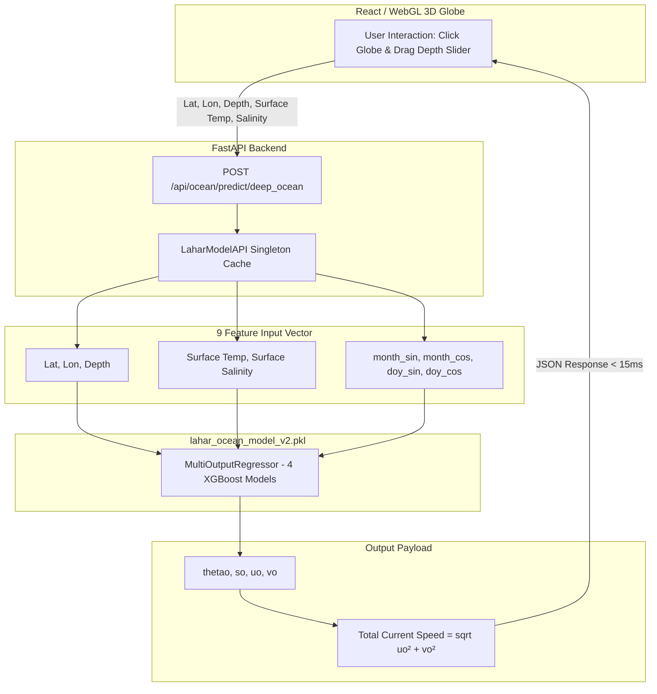

# Lahar Ocean ML Model Engine (V2)

The **Lahar Ocean ML Model (V2)** is a lightweight, high-performance machine learning inference engine designed to predict 3D subsurface ocean state variables (temperature, salinity, and current velocity vector fields) from surface data and spatial coordinates in real time.

Developed for **SamudraX** (SIH Problem Statement 26067), this ML model replaces multi-gigabyte NetCDF/Zarr disk slicing with a **10.7 MB Multi-Output XGBoost Regressor**, enabling sub-15ms latency for 3D volumetric web visualizations.

---

## 🏗️ Architecture & Workflow Overview



---

## 📋 Feature Engineering (Inputs & Outputs)

### Input Features (9 Dimensions)
| Feature Name | Description | Range / Unit | Source / Derivation |
| :--- | :--- | :--- | :--- |
| `latitude` | Spatial Latitude | `-20.0°N` to `25.0°N` | User click / geospatial query |
| `longitude` | Spatial Longitude | `50.0°E` to `100.0°E` | User click / geospatial query |
| `depth` | Subsurface Depth | `0.0m` to `2000.0m` | User depth slider |
| `surface_temp` | Sea Surface Temperature | `-2.0°C` to `40.0°C` | Surface dataset lookup |
| `surface_salinity`| Sea Surface Salinity | `0.0 PSU` to `40.0 PSU` | Surface dataset lookup |
| `month_sin` | Cyclical Month (Sin) | `[-1.0, 1.0]` | Derived: $\sin(2\pi \cdot \text{month} / 12)$ |
| `month_cos` | Cyclical Month (Cos) | `[-1.0, 1.0]` | Derived: $\cos(2\pi \cdot \text{month} / 12)$ |
| `doy_sin` | Cyclical Day of Year (Sin) | `[-1.0, 1.0]` | Derived: $\sin(2\pi \cdot \text{doy} / 365.25)$ |
| `doy_cos` | Cyclical Day of Year (Cos) | `[-1.0, 1.0]` | Derived: $\cos(2\pi \cdot \text{doy} / 365.25)$ |

### Output Predictions (5 Target Variables)
| Variable Name | Description | Units | Type |
| :--- | :--- | :--- | :--- |
| `thetao` | Sea Water Potential Temperature | °C | XGBoost Regressor Target |
| `so` | Sea Water Salinity | PSU | XGBoost Regressor Target |
| `uo` | Eastward Sea Water Velocity | m/s | XGBoost Regressor Target |
| `vo` | Northward Sea Water Velocity | m/s | XGBoost Regressor Target |
| `current_speed` | Total Current Velocity Magnitude | m/s | Derived post-inference: $\sqrt{u_o^2 + v_o^2}$ |

---

## ⚡ Performance & Evaluation Highlights

*   **Artifact File:** `lahar_ocean_model_v2.pkl` (10.7 MB)
*   **Metadata Config:** `lahar_ocean_model_v2_info.json`
*   **Inference Latency:** ~5 to 15 milliseconds per point prediction
*   **Trained Geographic Domain:** Indian Ocean (`Lat: -20° to 25°N`, `Lon: 50° to 100°E`, `Depth: 0 to 2000m`)

> [!NOTE]
> **Validation & Methodology Note:**  
> The model achieves high statistical metrics on naive random row-wise splits (RMSE: `0.431°C` for `thetao`, `0.128 PSU` for `so`). Note that random splits include surface rows (`depth=0` where input features match targets) and grid cell spatial autocorrelation. Production retraining plans incorporate spatial-block holdout splits excluding `depth=0` rows for unbiased generalization estimates.

---

## 🛠️ Developer Usage & Integration

### Option 1: Direct Python Class Import (Recommended)

```python
from backend.models.model_api import LaharModelAPI, predict_ocean_state

# Initialize API (loads model once)
api = LaharModelAPI()

# Make a prediction
result = api.predict(
    latitude=19.0,
    longitude=95.0,
    depth=1200.0,
    surface_temp=28.5,
    surface_salinity=35.2,
    month=1,
    day_of_year=15
)

print(f"Deep Temp: {result['thetao']:.2f} °C")
print(f"Current Speed: {result['current_speed']:.3f} m/s")
```

### Option 2: Using the Cached Singleton Helper

```python
from backend.models.model_api import predict_ocean_state

# Reuses in-memory cached model instance automatically
result = predict_ocean_state(19.0, 95.0, 1200.0, 28.5, 35.2)
```

---

## 🧪 Testing & Self-Demonstration

You can run a self-test of the ML model API by executing `model_api.py` directly:

```bash
python backend/models/model_api.py
```

This will run a health check, display model metadata, and execute both single-point and batch prediction demonstrations.
