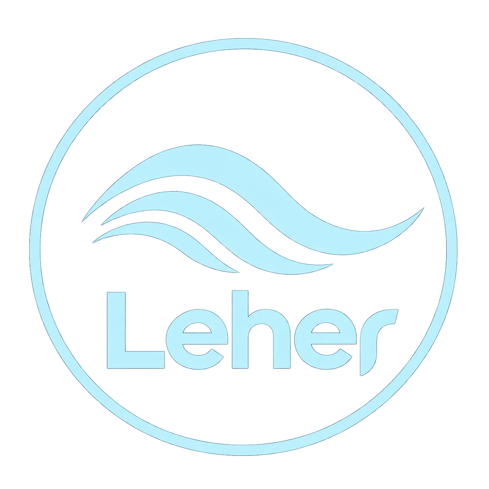

  

# Leher — 3D Ocean Bathymetry & Topography Globe

3D Bathymetry & Topography Globe integration for Leher (3D Ocean Intelligence Platform).

I wrote about how to create the interactive globe in this [blog post](https://www.esri.com/arcgis-blog/products/js-api-arcgis/3d-gis/interactive-3d-globe/) and John wrote about the Vibrant basemap that he created for Half-Earth project in this [blog post](https://www.esri.com/arcgis-blog/products/arcgis-pro/mapping/creating-the-half-earth-vibrant-basemap/).

[View it live](https://ralucanicola.github.io/the-globe-of-extremes/)
